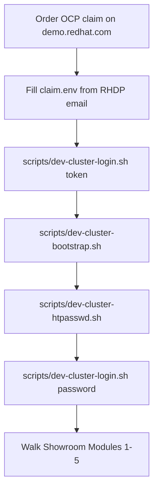

# Dev cluster bootstrap (Phase 5 AgnosticV bypass)

**Purpose:** Provision this workshop’s GitOps stack and Showroom labs onto **any ephemeral OpenShift claim** from [demo.redhat.com](https://demo.redhat.com) while AgnosticV access for `published.lightwell-tssc-workshop.prod` is blocked.

**This does not replace** catalog onboarding. When AgV unlocks, follow [`agnosticv/SUBMISSION.md`](../agnosticv/SUBMISSION.md). Use this path only for **instruction and chart QA**.

**Do not commit** per-claim hostnames, passwords, API tokens, or CA material. Claims are short-lived; standardize on the **field schema** below and a local `claim.env`.



`dev-cluster-bootstrap.sh` scales worker MachineSets when they ship at `replicas=0`, installs GitOps, grants Argo CD `cluster-admin`, and enables **Showroom + lightwellRepo** for Module 1. Enable heavier TSSC components later by sync wave.

## Reusable layout

| Path | Role |
|------|------|
| [`dev-cluster/claim.env.example`](../dev-cluster/claim.env.example) | Canonical env vars derived from a typical RHDP “Open” OpenShift email |
| `dev-cluster/claim.env` | **Local only** (gitignored) — copy of example filled for the current claim |
| `dev-cluster/*.ca.crt` | **Local only** — API CA from the email |
| [`dev-cluster/helm/`](../dev-cluster/helm/) | Helm chart: OpenShift GitOps Subscription (optional) + Argo `Application` for `charts/root-app` |
| [`scripts/dev-cluster-login.sh`](../scripts/dev-cluster-login.sh) | `oc login` from `claim.env` (`token` or `password`) |
| [`scripts/dev-cluster-scale-workers.sh`](../scripts/dev-cluster-scale-workers.sh) | Scale MachineSets when claims ship with `workers=0` |
| [`scripts/dev-cluster-bootstrap.sh`](../scripts/dev-cluster-bootstrap.sh) | Scale workers → GitOps → Argo root-app (`showroom` + `lightwellRepo`) + Argo cluster-admin |
| [`scripts/dev-cluster-htpasswd.sh`](../scripts/dev-cluster-htpasswd.sh) | HTPasswd IdP + `cluster-admin` user for stable console/`oc` login |
| [`scripts/dev-cluster-workshop-user.sh`](../scripts/dev-cluster-workshop-user.sh) | Single learner `user1` + random password (echo + gitignored persist) |
| [`docs/DEV-CLUSTER-WORKSHOP-USER.md`](./DEV-CLUSTER-WORKSHOP-USER.md) | **Agents:** capture workshop learner password for Module 5 tests |

Provisioning on the claim uses **Helm** (preferred; matches App-of-Apps). The same `claim.env` can drive Ansible/`oc` later if needed. Do **not** use Terraform to create AWS/OCP for this workshop — RHDP already provides the cluster; we only configure workloads.

## Standardized claim fields (from RHDP email)

Map the email / portal block into `claim.env` using these names:

| RHDP email content | Env var | Notes |
|--------------------|---------|--------|
| OpenShift API URL (`https://api.…:6443`) | `API_URL` | Required |
| Apps / ingress domain (`apps.…`) | `DEPLOYER_DOMAIN` | No `https://`; used as `deployer.domain` |
| OpenShift console URL | `CONSOLE_URL` | Documentation / smoke only |
| Cluster-admin API token | `OC_TOKEN` | Prefer SA token for **first** login / bootstrap |
| API CA certificate PEM | `OC_CA_FILE` | Path to local `.ca.crt` file |
| Bastion hostname | `BASTION_HOST` | Optional SSH jump |
| Bastion user | `BASTION_USER` | Often `lab-user` |
| kubeadmin user | `KUBEADMIN_USER` | Console only; keep password out of env if possible |
| AWS console URL | `AWS_CONSOLE_URL` | Optional; for worker scale |
| GitOps content repo | `GIT_REPO` | Default: this workshop’s GitHub URL |
| Git revision | `GIT_REVISION` | Default: `main` |
| Antora playbook | `ANTORA_PLAYBOOK` | Default: `site-ci.yml` for stock Showroom Antora images |
| HTPasswd admin user | `HTPASSWD_ADMIN_USER` | Default `admin` (after `dev-cluster-htpasswd.sh`) |
| HTPasswd admin password | `HTPASSWD_ADMIN_PASSWORD` | Local only in `claim.env` — never commit |
| Login mode | `OC_LOGIN_MODE` | `token` (bootstrap) then `password` (day-to-day) |
| Scale workers | `SCALE_WORKERS` / `WORKER_REPLICAS` | Default `true` / `2` — bare claims often start at MachineSet `0` |
| Module 1 apps | `ENABLE_LIGHTWELL_REPO` | Default `true` — channel + sample OSV ConfigMaps |
| Student Git | `ENABLE_GITEA` | Default `true` — single `user1` learner (see workshop-user doc) |
| Workshop learner | `WORKSHOP_USER` / `WORKSHOP_USER_PASSWORD` | Default `user1` / generated; echoed by bootstrap |

**Never commit** filled `claim.env`, CA files, or passwords. When the claim expires, delete the local files and start again from `claim.env.example`.

### Quick start

```bash
cp dev-cluster/claim.env.example dev-cluster/claim.env
# Edit claim.env — paste API_URL, DEPLOYER_DOMAIN, OC_TOKEN, OC_CA_FILE, …
# Save the email CA PEM to e.g. dev-cluster/cluster.ca.crt and set OC_CA_FILE
# Leave OC_LOGIN_MODE=token for the first login

./scripts/dev-cluster-login.sh
./scripts/dev-cluster-bootstrap.sh
# ↑ prints WORKSHOP LEARNER CREDENTIALS banner (user1 + random password)
#   Agents: copy password from stdout — see docs/DEV-CLUSTER-WORKSHOP-USER.md

# Stable admin user (HTPasswd IdP) — replaces relying on kubeadmin / SA token alone
./scripts/dev-cluster-htpasswd.sh
# Set OC_LOGIN_MODE=password in claim.env (HTPASSWD_ADMIN_* already in example)
./scripts/dev-cluster-login.sh

# Showroom after sync:
#   https://showroom.${DEPLOYER_DOMAIN}/
# Module 1:
#   https://showroom.${DEPLOYER_DOMAIN}/modules/module-01-overview.html
```

### HTPasswd IdP (dev-cluster only)

Ephemeral claims often ship with an empty OAuth `spec` and a short-lived kubeadmin/token. For repeatable QA:

1. Login with `OC_TOKEN` (cluster-admin SA from the email).
2. Run `./scripts/dev-cluster-htpasswd.sh` — creates `openshift-config/htpasswd-secret`, patches `oauth/cluster` with IdP `htpasswd_provider`, grants `cluster-admin` to `HTPASSWD_ADMIN_USER`.
3. Switch `OC_LOGIN_MODE=password` and re-login as `admin`.

This is **not** part of Field Content / AgnosticV production provisioning. Catalog learners use Showroom (and RHDP-issued access); the Showroom terminal SA gets lab RBAC from [`charts/components/showroom`](../charts/components/showroom/) (`terminal.labClusterAccess: true`).

### Workshop learner (`user1`) — agents read this

Bootstrap enables **Gitea** with **one** student: `user1`. A random password is generated
(unless `WORKSHOP_USER_PASSWORD` is already set in `claim.env`), printed in a banner at
the end of `dev-cluster-bootstrap.sh`, and written to gitignored
`dev-cluster/workshop-user.env` + `claim.env`.

**Agents generating or testing the environment must capture that password** and use it
for Module 5 / Gitea / promote walks. Full contract:
[`DEV-CLUSTER-WORKSHOP-USER.md`](./DEV-CLUSTER-WORKSHOP-USER.md).

```bash
# Re-print credentials without re-bootstrap:
./scripts/dev-cluster-workshop-user.sh
```

### Module 1 smoke (Showroom terminal)

After `lightwellRepo` is Healthy and Showroom is synced:

```bash
# Equivalent to Showroom /terminal/ (SA showroom:showroom)
oc -n showroom exec deploy/showroom -c terminal -- bash -lc '
  oc -n lightwell-repo get configmap lightwell-channels -o jsonpath="{.data.mode}{\"\\n\"}"
  oc -n lightwell-repo get configmap lightwell-sample-osv \
    -o jsonpath="{.data.LW-DEMO-0001\\.json}" | jq -r ".affected[0].ranges[0].events"
  oc get routes -A | grep -E -i "nexus|rhdh|trust|stackrox|showroom" || true
'
```

Expect `mode=seeded`, a `fixed: 5.3.18.rhlw-00003` event, and the Nexus/Showroom routes. If ConfigMap get is **Forbidden**, the Showroom lab ClusterRoleBinding is missing — sync `charts/components/showroom` with `terminal.labClusterAccess: true`.

## Why this works

| Concern | Approach |
|---------|----------|
| Delivery model | GitOps App-of-Apps: [`charts/root-app`](../charts/root-app/) |
| Domain / API injection | Bootstrap Helm sets `deployer.domain` / `deployer.apiUrl` (Field Content stand-in) |
| Ephemeral claims | Env + script; no cluster-specific docs in Git |
| Stable admin login | HTPasswd IdP via `dev-cluster-htpasswd.sh` (QA only) |
| Showroom `oc` labs | Chart ClusterRoleBinding `showroom-lab-cluster-admin` |
| Catalog identity | Dev QA only until AgnosticV unlocks |

## Target sizing

| Role | Count | vCPU | RAM |
|------|-------|------|-----|
| Control plane | 1 | 16 | 32 GB |
| Workers | 2 | 16 | 64 GB each |

~**32 vCPU / ~128 GiB** aggregate **worker** capacity before enabling RHACS / RHTPA / RHDH / heavy Tekton. Scale via the claim’s AWS console when provided. Avoid SNO for full Modules 1–5.

## Prerequisites when ordering

- OpenShift **cluster-admin** (or equivalent for operators + Argo Applications)
- Prefer claims that include **AWS console** access for node scale
- Lifespan **48h+** for multi-day QA when possible
- OperatorHub + working cluster **pull secret**
- Local `htpasswd` CLI (httpd / apache2-utils) for the IdP script

## Manual steps the scripts do not replace

### Progressive component enable (beyond Module 1)

Bootstrap enables **Showroom + lightwellRepo**. Root-app chart defaults keep other components `enabled: false`. Enable by sync wave for later modules:

| Order | Wave | Component | Lab focus |
|------:|------|-----------|-----------|
| ✓ | 50 | `showroom` | Modules prose + terminal (**bootstrap default**) |
| ✓ | 20 | `lightwellRepo` | Modules 1–3 ConfigMaps / Nexus (**bootstrap default**) |
| ✓ | 15 | `gitea` | Module 5 student Git — **single `user1`** (**bootstrap default**; see [WORKSHOP-USER](./DEV-CLUSTER-WORKSHOP-USER.md)) |
| 4 | 40 | `springBootLwPoc` | Monorepo Maven PoC only — keep **off** when Gitea gitops ApplicationSet is SoT |
| 5 | 5 | `keycloak` | SSO for RHTPA (`sso.<domain>/realms/tpa`) |
| 6 | 8 | `pipelines` | OpenShift Pipelines / Tekton (before `rhacs` Tasks) |
| 7 | 10 | `rhtas`, `rhtpa`, `rhacs` | Modules 4–5 (enable `keycloak` before `rhtpa`) |
| 8 | 30 | `rhdh` | Software Template |
| — | 40 | `parasolApp` | Keep **off** |

Override via PR to `main`, or temporary Helm values on the Argo Application. Prefer `ANTORA_PLAYBOOK=site-ci.yml` when the stock Antora image lacks Mermaid/tabs — see [`SHOWROOM-UPDATE-SPEC.md`](./SHOWROOM-UPDATE-SPEC.md).

If Machine API is unavailable, scale workers via `AWS_CONSOLE_URL` toward the sizing table, then re-run `./scripts/dev-cluster-scale-workers.sh` or bootstrap.

### Smoke checklist

- [ ] `lightwell-tssc-root` Application **Synced** / **Healthy**
- [ ] HTPasswd IdP present (`oc get oauth cluster -o jsonpath='{.spec.identityProviders[*].name}'`)
- [ ] `oc login` as `admin` with `OC_LOGIN_MODE=password`
- [ ] Bootstrap banner (or `./scripts/dev-cluster-workshop-user.sh`) shows `user1` + password; Gitea `demo-userinfo-gitea` matches after sync
- [ ] `https://showroom.${DEPLOYER_DOMAIN}/` serves Modules + FAQ appendix
- [ ] ClusterRoleBinding `showroom-lab-cluster-admin` exists
- [ ] Showroom terminal can `oc -n lightwell-repo get configmap lightwell-channels`
- [ ] Module 2 Maven Validated / Remediated against workshop Nexus
- [ ] Module 3 OSV → `.rhlw-*` path
- [ ] Modules 4–5 only after `rhtpa` / `rhacs` / `rhtas` Healthy

### Showroom-only fallback

If OpenShift GitOps is not ready yet:

```bash
set -a && source dev-cluster/claim.env && set +a
helm upgrade --install showroom charts/components/showroom \
  --set deployer.domain="${DEPLOYER_DOMAIN}" \
  --set deployer.apiUrl="${API_URL}" \
  --set showroom.content.antoraPlaybook="${ANTORA_PLAYBOOK:-site-ci.yml}" \
  --set showroom.content.repoRef="${GIT_REVISION:-main}" \
  --set showroom.terminal.labClusterAccess=true
```

## Claim-validation fixes (chart defaults)

Learned from OCP-on-AWS claim QA; defaults now match marketplace / OpenShift 4.20:

| Issue | Fix |
|-------|-----|
| RHTPA Subscription `stable` unsatisfiable | `operator.channel: stable-v3` |
| RHDH Backstage `v1alpha3` not served | `rhdh.apiVersion: rhdh.redhat.com/v1alpha5` |
| Operator apps fail dry-run before CRDs | root-app `SkipDryRunOnMissingResource` + `ServerSideApply` on TSSC/RHDH apps |
| Nexus `fsGroup: 200` blocked by restricted SCC | Nexus SA + `system:openshift:scc:anyuid` RoleBinding |
| Showroom terminal Forbidden on Module 1 `oc -n lightwell-repo` | `showroom.terminal.labClusterAccess` → ClusterRoleBinding `showroom-lab-cluster-admin` |
| Claim MachineSets at `replicas=0` / API starvation | `scripts/dev-cluster-scale-workers.sh` (called from bootstrap; `WORKER_REPLICAS=2`) |
| Argo CD cannot create namespaces / SCC bindings | Bootstrap Helm CRB + `oc adm policy` for `openshift-gitops-argocd-application-controller` |
| Module 1 ConfigMaps missing (`lightwellRepo` off) | Bootstrap Application values enable `components.lightwellRepo` (AgV `common.yaml` too) |
| Showroom PVC stuck Pending → sync deadlock | PVC sync-wave aligned with Deployment (`WaitForFirstConsumer` / gp3-csi) |
| RHACS Tasks fail without Tekton CRDs | Enable `components.pipelines` (wave 8) before / with Module 5 stack |
| Manual RHACS CI token / TPA restart | Jobs `rhacs-ci-token-mint` + `rhtpa-oidc-wait`; bootstrap `ENABLE_TSSC_STACK` |

Still manual on a bare claim (not fully automated yet):

- Run **HTPasswd IdP** script for stable `admin` login (dev-cluster only)
- Chart default `spring-boot-lw-poc.replicas: 0` (runtime image not published); set `replicas: 1` only after pushing `image.repository:tag`
- Control-plane instance size (claim `m6a.xlarge` masters can flap under load; prefer field-asset CNV sizing)

Automated in charts (enable via `ENABLE_TSSC_STACK=true` or individuals in `claim.env`):

- `components.keycloak` (wave 5) before `rhtpa` — workshop IdP at `https://sso.<domain>/realms/tpa`
- `components.pipelines` (wave 8) — Tekton CRDs before RHACS Tasks
- `components.rhtas` / `rhtpa` / `rhacs` (wave 10)
- Job `rhtpa-oidc-wait` — waits for Keycloak OIDC; rolls TPA `server` only if not Ready
- Job `rhacs-ci-token-mint` — mints Central Continuous Integration token into `rhacs-ci-secrets` (fallback: `./scripts/dev-cluster-rhacs-ci-token.sh`)

## Gaps vs real RHDP Field Content

| RHDP Field Content | This bypass |
|--------------------|-------------|
| Auto GitOps App + `deployer.*` | `dev-cluster` Helm + scripts |
| Babylon userinfo email | Console + Showroom Route |
| CNV pool sizing in AgnosticV | `dev-cluster-scale-workers.sh` (MachineSet) or AWS console |
| SSO / Keycloak for RHTPA | `charts/components/keycloak` (enable wave 5) |
| Learner cluster login | RHDP-issued access; **not** this HTPasswd IdP |
| Showroom terminal lab `oc` | Same chart RBAC (`labClusterAccess`) once GitOps syncs |
| Published catalog item | Still requires AgnosticV |

## Out of scope

- Publishing ephemeral claim hostnames, tokens, or passwords in Git
- Terraform greenfield AWS→OCP for this workshop
- AgnosticV PRs without human confirmation ([`AGENTS.md`](../AGENTS.md))
- Changing catalog IDs
- Shipping HTPasswd IdP via Field Content / AgnosticD (dev-cluster QA only)

## Related

- [`dev-cluster/helm/`](../dev-cluster/helm/) — bootstrap chart
- [`DEVELOPMENT-PLAN.md`](../DEVELOPMENT-PLAN.md) — Phase 5
- [`agnosticv/README.md`](../agnosticv/README.md) — sizing + draft leaves
- [`charts/README.md`](../charts/README.md) — sync waves
- [`roles/ocp4_workload_field_content/README.md`](../roles/ocp4_workload_field_content/README.md) — what Field Content automates on RHDP
