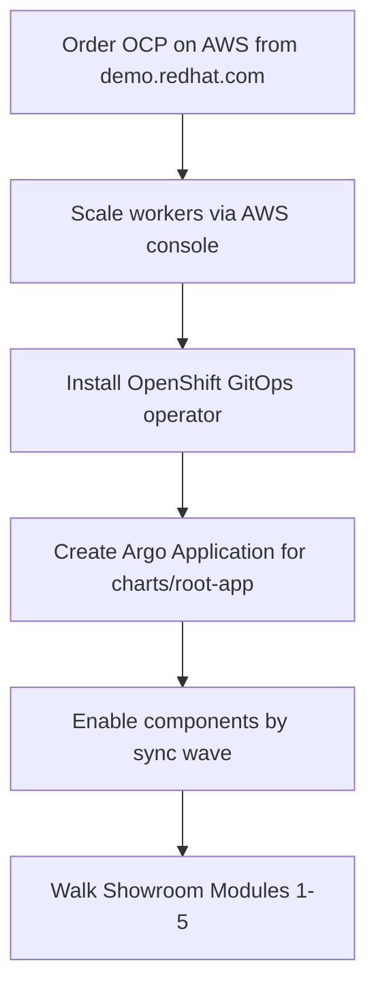

# Dev cluster bootstrap (Phase 5 AgnosticV bypass)

**Purpose:** Deploy and test this workshop’s GitOps content and Showroom labs on a **generic OpenShift claim** from [demo.redhat.com](https://demo.redhat.com) while AgnosticV access for `published.lightwell-tssc-workshop.prod` is blocked.

**This does not replace** catalog onboarding. When AgV unlocks, follow [`agnosticv/SUBMISSION.md`](../agnosticv/SUBMISSION.md) (dev-first → prod). Use this runbook only for **instruction and chart QA**.

**Preferred claim shape:** OpenShift on AWS with **cluster-admin** and **AWS console** access so you can scale workers. Prefer this over greenfield Terraform.



## Why this works

| Concern | Approach |
|---------|----------|
| Delivery model | Already GitOps App-of-Apps: [`charts/root-app`](../charts/root-app/) |
| Domain / API injection | Field Content normally sets `deployer.domain` / `deployer.apiUrl`; you set them on the Argo Application |
| Capacity | Scale via AWS toward sizing in [`agnosticv/README.md`](../agnosticv/README.md) |
| Catalog identity | Still blocked — treat the claim as a **dev QA cluster**, not the published catalog item |

## Target sizing

| Role | Count | vCPU | RAM |
|------|-------|------|-----|
| Control plane | 1 | 16 | 32 GB |
| Workers | 2 | 16 | 64 GB each |

Equivalent: ~**32 vCPU / ~128 GiB** aggregate **worker** capacity. Do **not** run the full Modules 1–5 stack on SNO or a tiny sandbox.

## Prerequisites when ordering

Order a catalog item that provides:

- OpenShift **cluster-admin** (install operators + create Argo Applications)
- **AWS console** (or EC2 / ASG / MachineSet access) to add or resize workers
- Lifespan suitable for multi-day QA (**48h+** preferred)
- OperatorHub + a working cluster **pull secret** for Red Hat operators

Record after the claim is ready:

```text
API URL:     https://api.<cluster>:6443
Apps domain: apps.<cluster>.<base>
Console:     https://console-openshift-console.apps.<...>
AWS console: <from RHDP userinfo / email>
oc login:    <token or kubeadmin>
```

## Step 1 — Scale workers

Before enabling RHACS, RHTPA, RHDH, or heavy Tekton:

1. Open the AWS console from the claim.
2. Resize or add worker nodes / MachineSets toward the table above.
3. Confirm nodes Ready:

```bash
oc get nodes -o wide
oc adm top nodes   # optional; needs metrics
```

## Step 2 — Install OpenShift GitOps

1. In the OpenShift console: **OperatorHub** → **OpenShift GitOps** → Install (default `openshift-gitops`).
2. Wait until the `openshift-gitops` namespace pods are Ready and the Argo CD route exists:

```bash
oc -n openshift-gitops get pods,route
```

3. Optional: install **OpenShift Pipelines** early if you will exercise Module 5 Tekton before enabling the RHACS chart’s Tasks.

## Step 3 — Create the root App-of-Apps

Substitute `DEPLOYER_DOMAIN` and `API_URL` from your claim.

```bash
export DEPLOYER_DOMAIN='apps.cluster-XXXX.XXXX.example.opentlc.com'   # no https://
export API_URL='https://api.cluster-XXXX.XXXX.example.opentlc.com:6443'
export GIT_REPO='https://github.com/NA-FSI-Services/lightwell-tssc-workshop.git'
export GIT_REVISION='main'
```

```bash
oc apply -f - <<EOF
apiVersion: argoproj.io/v1alpha1
kind: Application
metadata:
  name: lightwell-tssc-root
  namespace: openshift-gitops
spec:
  project: default
  source:
    repoURL: ${GIT_REPO}
    targetRevision: ${GIT_REVISION}
    path: charts/root-app
    helm:
      valuesObject:
        deployer:
          domain: ${DEPLOYER_DOMAIN}
          apiUrl: ${API_URL}
        # Override Showroom playbook if stock Antora image lacks Mermaid/tabs
        components:
          showroom:
            enabled: true
            content:
              antoraPlaybook: site-ci.yml
              repoRef: main
  destination:
    server: https://kubernetes.default.svc
    namespace: openshift-gitops
  syncPolicy:
    automated:
      prune: false
      selfHeal: true
    syncOptions:
      - CreateNamespace=true
EOF
```

Sync / health:

```bash
oc -n openshift-gitops get applications.argoproj.io lightwell-tssc-root
# Or open the Argo CD UI Route in openshift-gitops
```

### Helm alternative (no Argo yet)

If GitOps is delayed, you can still deploy **Showroom alone** (as on the sandbox):

```bash
helm upgrade --install showroom charts/components/showroom \
  --set deployer.domain="${DEPLOYER_DOMAIN}" \
  --set deployer.apiUrl="${API_URL}" \
  --set showroom.content.antoraPlaybook=site-ci.yml \
  --set showroom.content.repoRef=main
```

Prefer the Argo root Application for anything beyond Showroom.

## Step 4 — Progressive component enable

Defaults in [`charts/root-app/values.yaml`](../charts/root-app/values.yaml) keep most components `enabled: false` (Showroom is `true`). Enable in **sync-wave order**; do not turn everything on at once.

| Order | Wave | Component | Lab focus |
|------:|------|-----------|-----------|
| 1 | 50 | `showroom` | Modules prose + terminal |
| 2 | 20 | `lightwellRepo` | Modules 1–3 (seeded Nexus / channels) |
| 3 | 40 | `springBootLwPoc` | Maven PoC / pins |
| 4 | 10 | `rhtas`, `rhtpa`, `rhacs` | Modules 4–5 (after capacity) |
| 5 | 30 | `rhdh` | Software Template golden path |
| — | 40 | `parasolApp` | Keep **off** for critical path |

**How to enable:** PR to `main` flipping `components.<name>.enabled: true`, **or** temporary Helm `valuesObject` overrides on the Argo Application (fine for a short-lived QA claim).

**Showroom note:** Prefer `site-ci.yml` on clusters whose Antora image lacks `@sntke/antora-mermaid-extension` / tabs packages. Production RHDP Field Content may use `site.yml` when the image supports it — see [`docs/SHOWROOM-UPDATE-SPEC.md`](./SHOWROOM-UPDATE-SPEC.md).

## Step 5 — Smoke checklist

- [ ] `lightwell-tssc-root` Application **Synced** / **Healthy**
- [ ] Showroom Route serves Modules + [FAQ concepts appendix](https://github.com/NA-FSI-Services/lightwell-tssc-workshop/blob/main/docs/modules/ROOT/pages/appendix-lightwell-concepts.adoc)
- [ ] `oc -n lightwell-repo get configmap lightwell-channels` (after wave 20)
- [ ] Module 2: `mvn -s settings.xml -Plightwell-validated …` against workshop Nexus
- [ ] Module 3: OSV sample / `.rhlw-*` pin path
- [ ] Module 4: RHTPA Route + `syft` CycloneDX (after `rhtpa` Healthy)
- [ ] Module 5: dep-gate fail/pass + RHTAS only after `rhacs` / `rhtas` Healthy

Showroom URL pattern:

```text
https://showroom.${DEPLOYER_DOMAIN}/
```

## Gaps vs real RHDP Field Content

| RHDP Field Content | This bypass |
|--------------------|-------------|
| Auto GitOps App + `deployer.*` injection | You create the Application and set values |
| Babylon / catalog userinfo email | Use Showroom Route + OpenShift / AWS consoles |
| CNV pool sizing baked into AgnosticV | You scale via AWS |
| Catalog item `published.lightwell-tssc-workshop.prod` | Still requires AgnosticV ([`SUBMISSION.md`](../agnosticv/SUBMISSION.md)) |

## Out of scope

- Terraform / greenfield AWS→OCP provisioning for this workshop
- Opening PRs to [`redhat-cop/agnosticv`](https://github.com/redhat-cop/agnosticv) without human confirmation ([`AGENTS.md`](../AGENTS.md))
- Changing catalog IDs or claiming production catalog readiness

## Related

- [`DEVELOPMENT-PLAN.md`](../DEVELOPMENT-PLAN.md) — Phase 5
- [`agnosticv/README.md`](../agnosticv/README.md) — sizing + draft leaves
- [`charts/README.md`](../charts/README.md) — sync waves
- [`roles/ocp4_workload_field_content/README.md`](../roles/ocp4_workload_field_content/README.md) — what Field Content automates on RHDP
