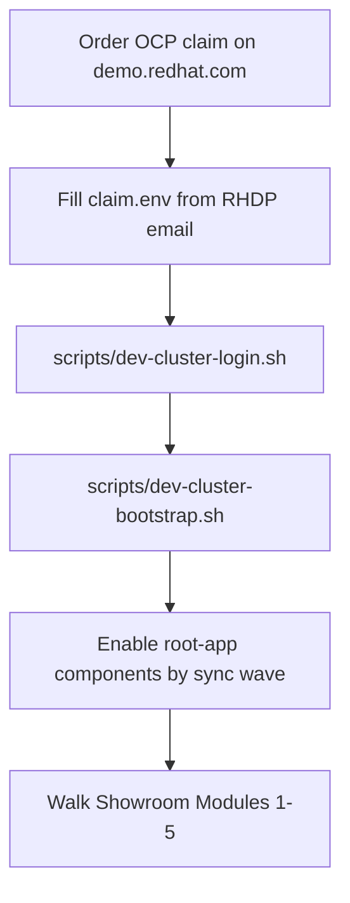

# Dev cluster bootstrap (Phase 5 AgnosticV bypass)

**Purpose:** Provision this workshop’s GitOps stack and Showroom labs onto **any ephemeral OpenShift claim** from [demo.redhat.com](https://demo.redhat.com) while AgnosticV access for `published.lightwell-tssc-workshop.prod` is blocked.

**This does not replace** catalog onboarding. When AgV unlocks, follow [`agnosticv/SUBMISSION.md`](../agnosticv/SUBMISSION.md). Use this path only for **instruction and chart QA**.

**Do not commit** per-claim hostnames, passwords, API tokens, or CA material. Claims are short-lived; standardize on the **field schema** below and a local `claim.env`.



## Reusable layout

| Path | Role |
|------|------|
| [`dev-cluster/claim.env.example`](../dev-cluster/claim.env.example) | Canonical env vars derived from a typical RHDP “Open” OpenShift email |
| `dev-cluster/claim.env` | **Local only** (gitignored) — copy of example filled for the current claim |
| `dev-cluster/*.ca.crt` | **Local only** — API CA from the email |
| [`dev-cluster/helm/`](../dev-cluster/helm/) | Helm chart: OpenShift GitOps Subscription (optional) + Argo `Application` for `charts/root-app` |
| [`scripts/dev-cluster-login.sh`](../scripts/dev-cluster-login.sh) | `oc login` from `claim.env` |
| [`scripts/dev-cluster-bootstrap.sh`](../scripts/dev-cluster-bootstrap.sh) | Render/apply Helm bootstrap against the logged-in cluster |

Provisioning on the claim uses **Helm** (preferred; matches App-of-Apps). The same `claim.env` can drive Ansible/`oc` later if needed. Do **not** use Terraform to create AWS/OCP for this workshop — RHDP already provides the cluster; we only configure workloads.

## Standardized claim fields (from RHDP email)

Map the email / portal block into `claim.env` using these names:

| RHDP email content | Env var | Notes |
|--------------------|---------|--------|
| OpenShift API URL (`https://api.…:6443`) | `API_URL` | Required |
| Apps / ingress domain (`apps.…`) | `DEPLOYER_DOMAIN` | No `https://`; used as `deployer.domain` |
| OpenShift console URL | `CONSOLE_URL` | Documentation / smoke only |
| Cluster-admin API token | `OC_TOKEN` | Prefer SA token over embedding kubeadmin password in scripts |
| API CA certificate PEM | `OC_CA_FILE` | Path to local `.ca.crt` file |
| Bastion hostname | `BASTION_HOST` | Optional SSH jump |
| Bastion user | `BASTION_USER` | Often `lab-user` |
| kubeadmin user | `KUBEADMIN_USER` | Console only; keep password out of env if possible |
| AWS console URL | `AWS_CONSOLE_URL` | Optional; for worker scale |
| GitOps content repo | `GIT_REPO` | Default: this workshop’s GitHub URL |
| Git revision | `GIT_REVISION` | Default: `main` |
| Antora playbook | `ANTORA_PLAYBOOK` | Default: `site-ci.yml` for stock Showroom Antora images |

**Never commit** filled `claim.env`, CA files, or passwords. When the claim expires, delete the local files and start again from `claim.env.example`.

### Quick start

```bash
cp dev-cluster/claim.env.example dev-cluster/claim.env
# Edit claim.env — paste API_URL, DEPLOYER_DOMAIN, OC_TOKEN, OC_CA_FILE, …
# Save the email CA PEM to e.g. dev-cluster/cluster.ca.crt and set OC_CA_FILE

./scripts/dev-cluster-login.sh
./scripts/dev-cluster-bootstrap.sh

# Showroom after sync:
#   https://showroom.${DEPLOYER_DOMAIN}/
```

## Why this works

| Concern | Approach |
|---------|----------|
| Delivery model | GitOps App-of-Apps: [`charts/root-app`](../charts/root-app/) |
| Domain / API injection | Bootstrap Helm sets `deployer.domain` / `deployer.apiUrl` (Field Content stand-in) |
| Ephemeral claims | Env + script; no cluster-specific docs in Git |
| Catalog identity | Dev QA only until AgnosticV unlocks |

## Target sizing

| Role | Count | vCPU | RAM |
|------|-------|------|-----|
| Control plane | 1 | 16 | 32 GB |
| Workers | 2 | 16 | 64 GB each |

~**32 vCPU / ~128 GiB** aggregate **worker** capacity before enabling RHACS / RHTPA / RHDH / heavy Tekton. Scale via the claim’s AWS console when provided. Avoid SNO for full Modules 1–5.

## Prerequisites when ordering

- OpenShift **cluster-admin** (or equivalent for operators + Argo Applications)
- Prefer claims that include **AWS console** access for node scale
- Lifespan **48h+** for multi-day QA when possible
- OperatorHub + working cluster **pull secret**

## Manual steps the scripts do not replace

### Scale workers

1. Open `AWS_CONSOLE_URL` from the claim (if present).
2. Resize / add workers toward the sizing table.
3. Confirm: `oc get nodes -o wide`

### Progressive component enable

Defaults in [`charts/root-app/values.yaml`](../charts/root-app/values.yaml) keep most components `enabled: false` (Showroom is `true`). Enable by sync wave:

| Order | Wave | Component | Lab focus |
|------:|------|-----------|-----------|
| 1 | 50 | `showroom` | Modules prose + terminal |
| 2 | 20 | `lightwellRepo` | Modules 1–3 |
| 3 | 40 | `springBootLwPoc` | Maven PoC / pins |
| 4 | 10 | `rhtas`, `rhtpa`, `rhacs` | Modules 4–5 |
| 5 | 30 | `rhdh` | Software Template |
| — | 40 | `parasolApp` | Keep **off** |

Override via PR to `main`, or temporary Helm values on the Argo Application. Prefer `ANTORA_PLAYBOOK=site-ci.yml` when the stock Antora image lacks Mermaid/tabs — see [`SHOWROOM-UPDATE-SPEC.md`](./SHOWROOM-UPDATE-SPEC.md).

### Smoke checklist

- [ ] `lightwell-tssc-root` Application **Synced** / **Healthy**
- [ ] `https://showroom.${DEPLOYER_DOMAIN}/` serves Modules + FAQ appendix
- [ ] `oc -n lightwell-repo get configmap lightwell-channels` (after wave 20)
- [ ] Module 2 Maven Validated / Remediated against workshop Nexus
- [ ] Module 3 OSV → `.rhlw-*` path
- [ ] Modules 4–5 only after `rhtpa` / `rhacs` / `rhtas` Healthy

### Showroom-only fallback

If OpenShift GitOps is not ready yet:

```bash
set -a && source dev-cluster/claim.env && set +a
helm upgrade --install showroom charts/components/showroom \
  --set deployer.domain="${DEPLOYER_DOMAIN}" \
  --set deployer.apiUrl="${API_URL}" \
  --set showroom.content.antoraPlaybook="${ANTORA_PLAYBOOK:-site-ci.yml}" \
  --set showroom.content.repoRef="${GIT_REVISION:-main}"
```

## Claim-validation fixes (chart defaults)

Learned from OCP-on-AWS claim QA; defaults now match marketplace / OpenShift 4.20:

| Issue | Fix |
|-------|-----|
| RHTPA Subscription `stable` unsatisfiable | `operator.channel: stable-v3` |
| RHDH Backstage `v1alpha3` not served | `rhdh.apiVersion: rhdh.redhat.com/v1alpha5` |
| Operator apps fail dry-run before CRDs | root-app `SkipDryRunOnMissingResource` + `ServerSideApply` on TSSC/RHDH apps |
| Nexus `fsGroup: 200` blocked by restricted SCC | Nexus SA + `system:openshift:scc:anyuid` RoleBinding |

Still manual on a bare claim (not in GitOps charts yet):

- Scale workers toward AgnosticV sizing
- Install **OpenShift Pipelines** from OperatorHub when not present
- Grant ArgoCD application-controller **cluster-admin** (or equivalent) so App-of-Apps can create namespaces/SAs
- **SSO / Keycloak** for RHTPA (`https://sso.<domain>/realms/tpa`) — RHDP Field Content usually supplies this; TPA server CrashLoops without it
- `spring-boot-lw-poc` runtime image is not published to the internal registry; labs use chart Maven source — scale Deployment to `0` if ImagePullBackOff distracts

## Gaps vs real RHDP Field Content

| RHDP Field Content | This bypass |
|--------------------|-------------|
| Auto GitOps App + `deployer.*` | `dev-cluster` Helm + scripts |
| Babylon userinfo email | Console + Showroom Route |
| CNV pool sizing in AgnosticV | Manual AWS scale on the claim |
| SSO / Keycloak for RHTPA | Not deployed by charts; TPA needs IdP |
| Published catalog item | Still requires AgnosticV |

## Out of scope

- Publishing ephemeral claim hostnames, tokens, or passwords in Git
- Terraform greenfield AWS→OCP for this workshop
- AgnosticV PRs without human confirmation ([`AGENTS.md`](../AGENTS.md))
- Changing catalog IDs

## Related

- [`dev-cluster/helm/`](../dev-cluster/helm/) — bootstrap chart
- [`DEVELOPMENT-PLAN.md`](../DEVELOPMENT-PLAN.md) — Phase 5
- [`agnosticv/README.md`](../agnosticv/README.md) — sizing + draft leaves
- [`charts/README.md`](../charts/README.md) — sync waves
- [`roles/ocp4_workload_field_content/README.md`](../roles/ocp4_workload_field_content/README.md) — what Field Content automates on RHDP
