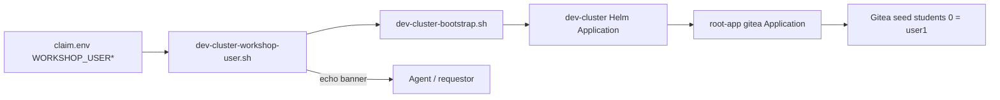

# Dev-cluster workshop learner (`user1`)

**Audience:** humans and coding agents provisioning an ephemeral claim for
instruction / chart QA.

**Purpose:** every fresh `./scripts/dev-cluster-bootstrap.sh` run uses **exactly one**
Gitea learner — `user1` — with a **random password** that is printed to the terminal
and saved only in gitignored local files.

Catalog / AgnosticV multi-user claims are separate; this document is **dev-cluster only**.

## Why

Module 5 (and Gitea seed / ApplicationSet promote) need stable learner credentials.
Using a fixed `workshop-student-changeme` in Git is unsafe and confusing for agents.
Generating a per-claim password and echoing it makes workshop tests copy-pasteable
without committing secrets.

## Contract

| Item | Value |
|------|--------|
| Username | `user1` (`WORKSHOP_USER`, default) |
| Password | Random alphanumeric (`WORKSHOP_USER_PASSWORD`) if unset |
| Student list | **Only** this user — do not seed a second Gitea student for QA |
| App repo | `https://gitea.<domain>/lw-user1/spring-boot-lw-poc.git` |
| GitOps repo | `https://gitea.<domain>/lw-user1/gitops-spring-boot-lw-poc.git` |
| Promote NS / Argo app | `lw-poc-user1` |

After Gitea sync, the same credentials appear in ConfigMap `demo-userinfo-gitea`
(`student_username` / `student_password`). Prefer that ConfigMap in lab steps;
use the bootstrap banner when the ConfigMap is not ready yet.

## What agents must do

1. Run (or ask the human to run) `./scripts/dev-cluster-bootstrap.sh` (or
   `./scripts/dev-cluster-workshop-user.sh` alone to mint/show credentials).
2. **Capture the printed banner** — username + password — from the script stdout.
3. Persist locally only: `dev-cluster/claim.env` and `dev-cluster/workshop-user.env`
   (both **gitignored**). Never commit passwords or paste them into issues/PRs.
4. When walking Module 5 / Gitea / promote tests, authenticate as `user1` with that
   password (or read `demo-userinfo-gitea` after sync).
5. Do **not** assume the chart default `student` / `workshop-student-changeme` on a
   bootstrap-provisioned claim — those defaults are for catalog chart templates only.

## Script output (example shape)

```text
================================================================================
 WORKSHOP LEARNER CREDENTIALS (dev-cluster QA only — do not commit)
================================================================================
  Username:     user1
  Password:     <random-alphanumeric>
  ...
  AGENTS: use this password for Module 5 / Gitea / promote workshop tests.
  Docs:   docs/DEV-CLUSTER-WORKSHOP-USER.md
================================================================================
```

Re-running bootstrap **reuses** an existing `WORKSHOP_USER_PASSWORD` from `claim.env`
or `workshop-user.env` so credentials stay stable for the life of the claim.

To force a new password: clear `WORKSHOP_USER_PASSWORD` in both files (or delete
`workshop-user.env`) and re-run `./scripts/dev-cluster-workshop-user.sh`.

## Wiring



- `ENABLE_GITEA=true` (claim.env default) enables `components.gitea` from bootstrap.
- Helm passes `gitea.students[0]` = `user1` + generated password into root-app.
- Root-app forwards `students` into the Gitea chart (overrides chart default `student`).

## Related

- [`docs/DEV-CLUSTER-BOOTSTRAP.md`](./DEV-CLUSTER-BOOTSTRAP.md) — full claim runbook
- [`scripts/dev-cluster-workshop-user.sh`](../scripts/dev-cluster-workshop-user.sh)
- [`scripts/dev-cluster-bootstrap.sh`](../scripts/dev-cluster-bootstrap.sh)
- [`dev-cluster/claim.env.example`](../dev-cluster/claim.env.example)
