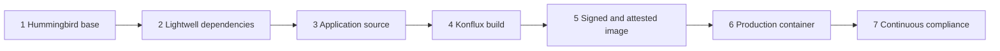

# Lightwell TSSC Workshop — Version 2 Development Plan

**Status:** ASK closed (Q1–Q31). Not yet reflected in `publishing-house/spec.yaml`.
**Date:** 2026-08-17
**North star:** one linear TSSC flow — Hummingbird base → Lightwell dependencies → application source → Konflux-class build → signed attested image → production container → continuous compliance.

This document plans how to **transform the lab environment and content** from the current dependency-centric workshop (v1) into a consultant-ready TSSC workshop (v2). It does **not** change the live catalog spec until you explicitly ask to apply it.

---

## 1. Why v2 exists

v1 teaches only the **library layer** of TSSC (Lightwell Maven / PyPI, OSV pins, app SBOM ingest, a dep-gate, keyless sign, GitOps digest promote). That is a real catalog gap, but it is not the Hummingbird + Lightwell value chain consultants deliver.

v2 is a **full rewrite** of the learner path (not a retrofit that keeps Modules 1–9 and bolts on Hummingbird). Reusable automation (Nexus, Gitea, RHDH, RHTAS, RHTPA, RHACS, Pipelines, GitOps) stays where it still fits. Content, nav, seeds, and gates are redesigned as **one linear TSSC flow**.

Learners must **modify** configuration and application assets, then **pass an evaluation script** before the next track unlocks. Reviewing a worked example is not enough to progress.

---

## 2. Current v1 inventory (what we already have)

| Layer | In v1 today | Notes |
|-------|-------------|--------|
| Lightwell Validated / Remediated / OSV | Yes | Java Modules 2–4, Python 7–8 |
| Enterprise artifact manager | Yes | Nexus proxying `packages.redhat.com/lightwell/*` |
| RHDH Software Templates | Yes | `lightwell-java-service`, `lightwell-python-service` |
| App SBOM (`syft` CycloneDX / SPDX) | Yes | Modules 5 and 8 — **generate + ingest**, not VEX audit |
| VEX | Narrative only | Mentioned in Module 1 / 5 / 8; no learner VEX exercise |
| Tekton policy gate | Yes | `lightwell-dep-gate` / `lightwell-python-dep-gate` on **pins**, not Conforma |
| Image build | OpenShift BuildConfig | Explicitly **not** Buildah / Hermeto / Konflux |
| Base image | UBI 9 (`ubi9/openjdk-17`, `ubi9/python-312`) | Not Hummingbird |
| RHTAS keyless sign + `cosign verify` | Yes | Verifies the **learner-built** image, not the upstream base |
| Argo CD digest promotion | Yes | Stage-like GitOps; no prod vs non-prod registry split |
| RHACS image check | Yes | Pipeline task; limited runtime / IR story |
| Admission-time signature policy | No | No `ClusterImagePolicy`, Kyverno, or Conforma at deploy |
| oc-mirror / disconnected ingest | Note only | Module 2 mentions air-gap; no hands-on mirror |
| Hummingbird | Out of scope | Parasol README: stretch #30 / #31 |
| bootc / Satellite / SIEM | No | |
| Per-module evaluation scripts | No | Observable outcomes only; no progress lock |

**Duration today:** ~4.5 hours (9 modules, Java then Python).
**Audience today:** application developers, DevSecOps, platform engineers.
**Topology:** per-student OpenShift 4.20 CNV, one `student` user.

Lightwell consumption remains a **required track** in v2 (the catalog gap no other RHDP item covers). It is no longer the whole lab. v1 module structure, Java-then-Python sequencing, and “observe then continue” assessment are **retired**.

---

## 3. Consultant activity map — lab vs playbook vs out of RHDP

Red Hat Services work listed in the request is a **delivery catalog**, not a 4-hour lab script. v2 should train consultants on the **patterns they will implement**, using a faithful but reduced RHDP environment.

Legend:

- **Modify + gate** — learner changes a real asset; an evaluation script must pass before the next track unlocks
- **Hands-on** — learner performs it in Showroom (prefer Modify + gate whenever an asset exists)
- **Instructor demo / seeded** — environment does it; learner inspects (never the only activity in a gated module)
- **Playbook appendix** — procedure, architecture, and talking points; not executed on the claim
- **Out of RHDP** — cannot be reproduced honestly on a connected per-student cluster

### 3.1 Publish verified images (Hummingbird)

| Services activity | v2 treatment | Rationale |
|-------------------|--------------|-----------|
| Build minimal Fedora Hummingbird images | Playbook | Hummingbird is **published** by Red Hat (Konflux). Consultants consume and verify; they do not rebuild the Fedora pipeline in a customer PoV. |
| CVE-scan and FIPS-validate bases / runtimes | Modify + gate (scan/VEX); FIPS = narrative | Learners record scan/VEX findings in a lab artifact the validator reads. FIPS validation is a product claim, not a lab rebuild. |
| Strip packages / minimize surface | Modify + gate | Learner edits a comparison worksheet or policy (for example max RPM count / disallowed packages) against the Hummingbird SBOM; validator checks the recorded values. |
| Attach SBOM + in-toto provenance | Modify + gate | Learner writes or completes a verify script / trust-policy fragment; validator re-runs the same checks against the digest they recorded. |
| Sign with Sigstore / cosign | Modify + gate | Learner fills identity/issuer (or key) in a policy file; validator fails if they left the seeded placeholder. |
| Continuous rebuild on upstream CVE | Playbook | Show digest / tag freshness; do not run Red Hat's rebuild factory. |
| Dual arch amd64 + arm64 | Callout | **Q23:** one sentence on Track 1 — the index may include arm64. Check does not inspect architectures. Cluster is amd64. Hands-on dual-arch stays Epic D (V2-95). |
| Publish to RH registry → customer Artifactory | Hands-on **mirror** | Mirror into in-cluster registry (or Nexus/Quay stand-in), not a real Artifactory SaaS unless scoped in. |

### 3.2 Pull trusted artifacts into build

| Services activity | v2 treatment | Rationale |
|-------------------|--------------|-----------|
| Artifactory virtual repos → Lightwell only | Nexus scored + Artifactory callout | Hands-on is Nexus virtual repos to Lightwell. Same modules describe Artifactory virtual-repo / include-pattern equivalents. No Artifactory install. |
| Pull signed Hummingbird bases for app builds | Modify + gate | Learner changes Dockerfiles from UBI → Hummingbird runtime. Validator checks the committed `FROM` digest. |
| Hermetic Konflux builds / Hermeto | Modify + gate (4.2) | **Q16 all three:** Hermeto (or prefetch) task is scored. Learner adds it; Check fails if undeclared deps are not prefetched. Not a Konflux install. |
| Conforma reject unapproved transitives | Modify + gate | Learner authors or tightens an Enterprise Contract / Conforma rule. Validator applies it to a known-bad image (must fail) and the learner image (must pass). |
| Cache / proxy for disconnected | Modify + gate | Learner points `FROM` / Maven / pip at internal remotes only. Validator fails if any remaining external registry or `packages.redhat.com` direct URL is in the active build files. |
| Renovate auto-update to vetted versions | Modify + gate (3.3) | **Q24 live bot:** Renovate (or MintMaker-class) in the claim opens a PR on **in-cluster Gitea** for Lightwell + Hummingbird pins. Learner reviews/merges. Check: PR is from the bot (not a hand commit) and pins moved. |
| Validate SBOM + provenance before build | Modify + gate | Learner enables or wires the verify-base task in the pipeline YAML. Validator checks the Pipeline definition includes the task and a failing base cannot start the build. |

### 3.3 Build, sign, and promote (Konflux CI)

| Services activity | v2 treatment | Rationale |
|-------------------|--------------|-----------|
| Tekton Konflux pipelines | OpenShift Pipelines + **mapping appendix only** | Do **not** install Konflux. Do **not** rename cluster tasks to Konflux product names. Consultants quote the mapping table (Buildah, Hermeto, Clair, Chains, Conforma, Release → what this cluster runs). |
| Buildah rootless OCI builds | Mapping appendix only | **Keep OpenShift BuildConfig** (v1 pattern). SoW “Buildah” → lab BuildConfig. No Buildah task in the scored pipeline. |
| Generate SBOM per build | Keep + extend | App SBOM already exists; add **image SBOM** (base + app layers) and attach as OCI artifact. |
| Sign with TAS (keyless) | Modify + gate (5.1) | Scored keyless sign + `cosign verify` on the app digest (RHTAS). |
| SLSA L3 via Tekton Chains / in-toto | Modify + gate (5.2) | Attestation + Conforma. |
| Key-based / disconnected verify | Modify + gate (5.3) | **Both scored:** after keyless, a second Check: mirrored TUF root + key-based `cosign verify`. Cluster is still networked; this is the air-gap *procedure*, not a real diode. |
| Author Conforma policies | Modify + gate | Learner writes CVE threshold (or “must be signed Hummingbird + Lightwell pin”), license allow-list stub, org gate. Seeded policy is **too permissive** until they edit it. |
| Hermetic verification | Modify + gate (4.1–4.3) | **Q16 all three scored:** (1) Dockerfile/source forbid-list (`FROM`/`curl`/public URL), (2) Hermeto prefetch task, (3) NetworkPolicy on the **build** namespace. Buildah isolation is out (Q10). |
| Promotion event to GitOps | Modify + gate (6.2) | Learner commits the signed digest to the **prod GitOps repo** (second remote). Check fails if prod Argo still tracks stage. |
| bootc-image-builder → QCOW2/VMDK/ISO | Callout | Same signed digest, different runtime. No playbook module, no VM in the claim. |

### 3.4 Mirror and transfer (disconnected ingestion)

| Services activity | v2 treatment | Rationale |
|-------------------|--------------|-----------|
| oc-mirror v2 on DMZ bastion | Modify + gate | **Every learner runs oc-mirror** (not a finished provision Job). They complete an incomplete `ImageSetConfiguration` (missing image, signature, or SBOM artifact type), then execute oc-mirror. In-cluster stand-in for a DMZ host, not a real air-gap. |
| Mirror images + cosign signatures + attestations | Modify + gate | Validator: image **and** signature/SBOM artifacts exist internally; `cosign verify` succeeds against the **internal** digest the learner recorded. |
| Mirror Lightwell Maven / pip indexes | Modify + gate (Track 2) | Learner edits `settings.xml` / `pip.conf` rather than only extracting a finished ConfigMap. |
| Physical media / data diode | Playbook | Cannot do air-gap physics on RHDP. |
| Delta-sync via oc-mirror statefile | Modify + gate (thin) | Learner compares two statefiles or sets `mirror.continue` / delta flags; validator checks the applied config is incremental, not a copy of the full-seed example. |

### 3.5 Artifact signature verification

| Services activity | v2 treatment | Rationale |
|-------------------|--------------|-----------|
| Pre-download TUF root for disconnected cosign | Modify + gate | Learner copies/exports the TUF root to the lab trust path the validator uses (not the pre-mounted finished path). |
| `cosign verify` per image | Modify + gate | Learner records Hummingbird **and** app digests in a lab ConfigMap / values file; validator verifies those refs, not a hardcoded answer. |
| Verify SLSA + SBOM authenticity | Modify + gate | Learner fills expected predicate type / SBOM digest in the trust-policy; mismatch fails the gate. |
| Verify Lightwell GPG / PEP 740 | Stretch + gate if in-scope | Java GPG and Python PEP 740 if artifacts in Nexus actually carry them; learner enables verification in `settings.xml` / `pip.conf`. |
| Reject failures before build | Modify + gate | Learner turns the reject rule on (seeded off or too weak). Validator runs a known-unsigned image and expects failure. |
| ClusterImagePolicy (OCP 4.21+) | Modify + gate (portable policy) | **4.20 now:** Kyverno and/or RHACS admission. **4.21 when the catalog can move:** same learner edit applies as `ClusterImagePolicy`. Seeded policy does not match the Hummingbird identity until they edit it. |

### 3.6 Deploy and operate (GitOps)

| Services activity | v2 treatment | Rationale |
|-------------------|--------------|-----------|
| OpenShift GitOps / Argo CD | Modify + gate | Already Modules 6 / 9. Learner edits Helm values (digest, repo, namespace); validator checks the live Application spec, not a screenshot. |
| Admission-time signature verification | Modify + gate | Learner completes a **portable** trust policy. On 4.20 the gate is Kyverno/RHACS; on 4.21+ the same fields become `ClusterImagePolicy`. Validator denies unsigned. |
| Rolling / canary / blue-green | Callout | **Q15:** scored path is **rolling**. Canary / blue-green = one-line callout on 6.1 (same pattern as the VM note). No extra Check. |
| KSPM / NetworkPolicy | Modify + gate | **Two policies:** Track 4 **build-ns** hermetic egress (Q16); Track 6 **app-ns** operate (seeded open). Validator checks each at its Check. |
| Continuous compliance post-deploy | Modify + gate | Learner re-ingests or labels the promoted digest in TPA; validator queries TPA for that digest. |
| TPA blast-radius / incident response | Modify + gate | Learner writes the blast-radius answer (CVE → images/packages) into a lab report artifact; validator checks required fields and expected CVE id. |
| ACS / StackRox runtime | Modify + gate (thin) | Learner enables or scopes one runtime policy; validator checks the policy exists and is not the default-disabled stub. |
| SIEM / SOAR | Playbook | Out of RHDP. |
| Satellite + bootc upgrades | Callout | **Q14:** one short note on Track 6 — a VM is the same digest story. No appendix playbook. 6.2 is prod GitOps (Q25). Hands-on VM stays Epic D (V2-94). |

---

## 4. Recommended v2 shape

### 4.1 Product thesis (one sentence)

**v2 walks a consultant through one trusted supply chain: verify a Hummingbird base, consume Lightwell dependencies, own the application source, build in a Konflux-class pipeline, produce a signed attested image, promote to a production container, then prove continuous compliance.**

### 4.2 Audience — RESOLVED

| | v1 | v2 |
|--|----|----|
| **Primary** | Developers / DevSecOps | **Services consultants and architects** (enablement and PoV delivery) |
| Secondary | — | Customer developers / DevSecOps may attend; content is **not** rewritten for them as the lead persona |
| Outcome | “I can wire Lightwell into Maven/pip and a pipeline” | “I can run a customer PoV across OS + libraries + source + build + sign + prod + compliance” |
| Talking track | Remediation gap | Hummingbird + Lightwell combined TSSC value chain |
| Content | Nine modules, Java then Python | **Seven sequential tracks**; **Java hands-on**; Python as equivalent callouts on those modules |
| Voice | Learner-as-app-developer | Learner-as-**delivery consultant**: SoW why, customer-vs-Red Hat operate, talking points, then the same hands-on modification + gate |

Each gated module includes **delivery notes** (why this step exists in a SoW, what the customer must provide, what Red Hat operates vs what the customer operates). Do not ship a second “developer edition” of the lab unless a later ASK reopens persona.

### 4.2.1 Application language — RESOLVED

| Decision | Resolution |
|----------|------------|
| Hands-on app | **One Java application** through all seven tracks (one Git repo, Dockerfile, pipeline, GitOps). |
| Lightwell ecosystem scored | **Maven** (`settings.xml`, `.rhlw-*` pins, `pom.xml`). |
| Python | **Equivalent descriptions on the Java modules** — not a second gated path, not a second app to build. |
| v1 Python modules 7–9 | Mine for callout text; do **not** keep a parallel Python track in nav. |

Every gated Java module that has a Python analogue gets a **Python equivalent** callout (same pattern, different files/syntax). Consultants can reuse the talking points on a PyPI customer. The evaluation script checks **Java assets only**.

| Java (scored) | Python equivalent (describe, do not gate) |
|---------------|-------------------------------------------|
| `settings.xml` profiles / Nexus repo ids | `pip.conf` / index-url to Lightwell PyPI |
| `pom.xml` + `.rhlw-00001` | `requirements.txt` + PEP 440 `+rhlw.00001` |
| RHDH `lightwell-java-service` | RHDH `lightwell-python-service` (same golden-path idea) |
| `FROM` Hummingbird Java runtime | `FROM` Hummingbird Python runtime (same digest-pin / verify story) |
| Maven hermetic / settings mirror | pip prefetch / `--index-url` internal only |
| CycloneDX typical for Maven | SPDX typical for wheels; still ingest CycloneDX to TPA if that is the lab API |
| GPG / Maven signature (if in-scope) | PEP 740 / wheel attestation (if in-scope) |

Do **not** add a second PipelineRun, GitOps repo, or Check button for FastAPI unless Q4 is reopened. Epic D `V2-90` stays a later extra *app*, not these callouts.

### 4.2.2 Artifact manager — RESOLVED

| Decision | Resolution |
|----------|------------|
| Scored product | **Nexus** (existing Lightwell proxy / virtual-repo pattern). |
| FSI SoW name | **JFrog Artifactory callouts** on the same modules (virtual repo, include/exclude, Lightwell remote). |
| Install Artifactory | **No** for v2 GA. |

Same rule as Python: evaluation scripts check Nexus/`settings.xml` only. Consultants get talking points to map the pattern onto Artifactory at a customer.

### 4.2.3 Branding — RESOLVED: generic TSSC

| Decision | Resolution |
|----------|------------|
| Catalog title / nav / module titles | **Generic TSSC language.** Name tracks by the technical step (Hummingbird base, Lightwell dependencies, source, build, sign, production, compliance). |
| FSI infographic | **Author/SoW reference only.** Do not copy infographic titles into nav, Showroom headings, or the public catalog name. |
| Product names | Use real product names where the lab runs them (Hummingbird, Lightwell, Nexus, RHTAS, …). Do not add FSI, vertical, or campaign framing. |

Working catalog title stays in the TSSC family (exact string later in `spec.yaml`). Do not retitle modules to match the FSI value-chain graphic.

### 4.2.4 Jira — RESOLVED: same ticket RHDPCD-908

v2 is a **content/automation rewrite on this catalog**, tracked on **RHDPCD-908**. Do not open a second RHDPCD for v2. GitHub issues (V2-*) are comments/sub-tasks against 908 when filed; `spec.yaml` `jira_ticket` stays `RHDPCD-908`.

### 4.2.5 Technical sign-off — RESOLVED: catalog owner

**Signer:** the **catalog owner / RHDPCD-908 assignee** (`spec.yaml` `project.owner_email` today: `treddy@redhat.com`). No separate Hummingbird PM, TSSC architect, or FSI practice-lead gate for GA.

Consultants and product SMEs may review informally; they are **not** a blocking sign-off.

### 4.2.6 Enablement success — RESOLVED: internal checklist

**Metric:** a consultant is enabled when they **pass an internal checklist** covering the same seven tracks — not when they have run a customer PoV unassisted.

The lab gates (§10 items 1–10) prove they can operate the claim. The checklist is a **separate scored rubric** (same track outcomes) after the workshop. Unassisted PoV delivery is a later field outcome, not the v2 success metric.

### 4.2.7 Non-GA products — RESOLVED: Hummingbird / Hardened Images

When `spec.yaml` is updated for v2:

| Field | Value |
|-------|--------|
| `non_ga_products` | **Hummingbird** and **Red Hat Hardened Images** (exact catalog strings from V2-1). |
| `non_ga_access_plan` | Written in V2-1 with entitlement + digest-refresh owner (Q6). |
| Lightwell, Nexus, RHTAS, RHTPA, RHACS, Pipelines, GitOps | **GA** — do not list. |

Do not treat ClusterImagePolicy as a non-GA product: the scored path on 4.20 is Kyverno/RHACS.

### 4.2.8 External services — RESOLVED: minimal + in-cluster Gitea

`spec.environment.external_services` is the **egress allowlist** (hosts the claim must reach on the internet). v2 is **minimal**:

| Host | v2 |
|------|-----|
| `github.com` | **Drop.** Ship `cosign`, `oc-mirror`, `ec` in the Showroom image (or cluster). |
| Hummingbird / Hardened Images registry | **Add only the host V2-1 proves** is required for learner oc-mirror. Placeholder until the spike; do not invent `quay.io/hummingbird` in the spec. |
| `packages.redhat.com` | **Keep only if** Nexus still proxies live Lightwell. If Track 2 is fully stubbed in Nexus, drop it. |
| TPA CSAF mirrors | **Do not add** (not the gate). |
| **Gitea** | **In-cluster Git endpoint**, not egress. Learners use `gitea_url` from ConfigMap `demo-userinfo-gitea` (per-claim route). Do not put a fake `gitea.example.com` on the allowlist. Document it as the lab Git remote in content and userinfo; if a spec string is required for “learner services,” it is that ConfigMap URL, not a catalog hostname. |

### 4.2.9 Multi-arch — RESOLVED: callout only

**Scored:** amd64 only (CNV). Track 1 Check verifies the digest the learner recorded; it does **not** inspect `arm64` manifests.

**Callout on 1.1:** the published index may include other architectures (arm64). Same digest story, different runtime. No extra Check. Dual-arch exercise stays Epic D (V2-95).

### 4.2.10 Renovate — RESOLVED: live bot

**Scored (3.3):** Renovate (MintMaker = mapping-appendix name) runs **in the claim** against the learner Gitea app repo. It must open a real PR that updates **Lightwell** and **Hummingbird** pins. Learner reviews and merges. Check fails if the pin change is a hand commit or a seeded PR copied from the example.

**Not a Konflux install.** MintMaker in a SoW maps to this Renovate Job/controller.

**Flake:** Check waits for the PR (retry/timeout). Seed a *stale* pin so the bot has work. Extra egress for the bot image/indexes is an **exception to Q22** — V2-24 lists only the hosts the bot actually needs (do not re-add `github.com` for learner CLI downloads).

### 4.2.11 Prod promotion — RESOLVED: two GitOps repos

**Scored:** **two remotes** on in-cluster Gitea — **stage** GitOps and **prod** GitOps. Learner commits the signed digest to the **prod** repo. Check: Argo CD prod Application sources the prod remote (not stage); unsigned still denied.

**Not scored:** two Helm files in one repo, or two registries as the *primary* split. Prod namespace may still differ from stage as a consequence of the prod Application — that is not a third Check.

**Callouts on 6.1/6.2 unchanged:** VM = same digest; canary/blue-green exist; rolling is the strategy.

### 4.3 Packaging — RESOLVED

The previous A / B / C options assumed “keep v1 (Lightwell) and optionally add Hummingbird.” That is obsolete.

| Decision | Resolution |
|----------|------------|
| Catalog | **One public RHDP catalog item** (this repo / this claim). Not a companion lab and not enablement-only. |
| Learner path | **One linear TSSC flow** — seven sequential tracks. No skippable “Track A vs Track B.” |
| v1 modules | **Full redo.** Reuse platform charts where they still fit; do not keep Modules 1–9 as the spine. |
| Progression | Modify assets → evaluation script must **pass** before the next track (or next module in that track) unlocks (§4.6). |
| Scheduling envelope | **Two-day event.** Clock time is **not** the design constraint. |
| Content vs duration | **Coverage first.** Split a track into as many gated modules as the TSSC story needs. Do not drop or squash a learning outcome to hit a clock. Measure duration after content exists and back-fill `spec.duration_hours`. |
| What A / B / C were | **A** (keep v1 + optional Hummingbird) — rejected. **B** (companion that assumes v1) — rejected. **C** (internal workbook only) — rejected. |

§4.3 is **closed**. Do not re-open catalog shape or duration-as-constraint.

### 4.4 Seven TSSC tracks (replaces v1 modules and the old Track A/B split)

Tracks are the **story**. Modules are however many gated Check points coverage needs. Do **not** default to one module per track.

**Design rule:** prefer another gated module over stuffing two unrelated modifications into one Check. Empiric timing comes later.

| Track | Title | Learner does | Gate (evaluation script) | v1 leftover |
|-------|-------|--------------|--------------------------|-------------|
| **1** | Hummingbird base image | Complete trust policy; verify published image; edit incomplete `ImageSetConfiguration`; **run oc-mirror** so image + signatures + SBOM land in the cluster | `cosign verify` against the **learner-recorded internal digest**; artifacts exist only after **their** oc-mirror run | None (new) |
| **2** | Lightwell dependencies | Author `settings.xml` from a stub; pin `.rhlw-*` on a broken `pom.xml`. Python: describe `pip.conf` + `+rhlw.*` | Resolve from Nexus **Maven** remotes; dependency tree shows remediated GAV | Condenses old M2–M4; M7–M8 become callouts |
| **3** | Application source code | Scaffold or clone; `FROM` mirrored Hummingbird; Lightwell pins; **3.3 live Renovate PR** (Lightwell + Hummingbird pins) | Committed Dockerfile + pins; bot PR merged (not a hand-edit); no forbidden fetches | Condenses old M3 scaffold; customization lives here |
| **4** | Konflux build (story) | **4.1** source forbid-list; **4.2** Hermeto prefetch; **4.3** build-ns NetworkPolicy; **4.4** BuildConfig + SBOM. Mapping appendix = SoW Konflux terms | All four Checks pass; known-bad Dockerfile still fails; undeclared network blocked | Replaces M6/M9 build slice |
| **5** | Signed and attested image | **5.1** keyless RHTAS sign + verify; **5.2** SLSA + Conforma; **5.3** mirrored TUF + key-based verify (disconnected procedure) | Both 5.1 and 5.3 Checks pass; Conforma fail-then-pass | Replaces keyless-only M6/M9 |
| **6** | Production container | **6.1** admission + stage GitOps; **6.2** commit signed digest to **prod GitOps repo**. Callouts: VM = same digest; canary/blue-green; rolling | Unsigned deny; prod Argo app Healthy from the **prod** remote (not stage) | Replaces GitOps slice of M6/M9 |
| **7** | Continuous compliance | Ingest Lightwell GAV-bound VEX (+ app SBOM) into TPA; blast-radius report: CVE remediated **via Lightwell pin**. Hummingbird/CSAF = OS-layer callout. ACS control on | TPA has learner-ingested Lightwell VEX/SBOM; report CVE + status match the GAV seed; ACS not the disabled stub | Replaces narrative VEX; old M5 ingest moves here |

#### Coverage-first module split

Each row is its own **Your change** + **Check**. Applied to the live spec in V2-30 (ungated intro + 18 gated outlines in `publishing-house/spec/modules/`). Names can still change in Showroom filenames (V2-31…42).

| Proposed module | Track | Coverage |
|-----------------|-------|----------|
| Intro (ungated) | — | Seven-track diagram; what this cluster is not; honor-system note. **No** Validate Job. First Check is 1.1 |
| 1.1 Verify Hummingbird | 1 | Trust policy, `cosign verify`, SBOM download, attestation. **Callout:** index may include arm64; Check is amd64 digest only |
| 1.2 Mirror into the trust boundary | 1 | Incomplete ImageSet; **learner runs oc-mirror**; signatures + SBOM artifacts; verify **internal** digest |
| 2.1 Enterprise proxy | 2 | Author `settings.xml` from stub; **Python equivalent:** `pip.conf`; **Artifactory equivalent:** virtual repo / remote to Lightwell |
| 2.2 Remediated pin | 2 | OSV / `.rhlw-*` on broken `pom.xml`; **Python equivalent:** `+rhlw.*` on `requirements.txt` |
| 3.1 Golden-path source | 3 | Scaffold or clone; app repo is learner-owned |
| 3.2 Bind base + deps in source | 3 | `FROM` mirrored Hummingbird; Lightwell pins; strip forbidden fetches |
| 3.3 Live Renovate | 3 | Bot opens PR on Gitea for Lightwell + Hummingbird pins; learner merges; Check rejects a hand-edited “fake Renovate” commit |
| 4.1 Source forbid-list | 4 | Seeded Dockerfile still has forbidden `FROM`/`curl`/public URL; Check fails until removed |
| 4.2 Hermeto prefetch | 4 | Learner adds Hermeto (or prefetch) task; Check fails if undeclared deps are not prefetched |
| 4.3 Build NetworkPolicy | 4 | Learner authors deny-egress / allow-list on the **build** namespace; Check confirms it is live |
| 4.4 Build + SBOM | 4 | BuildConfig image lands; SBOM artifact; known-bad Dockerfile still fails |
| 5.1 Sign (keyless) | 5 | RHTAS keyless sign + `cosign verify` on **app** digest |
| 5.2 Attest + Conforma | 5 | SLSA / in-toto; learner-tightened policy fail-then-pass |
| 5.3 Disconnected verify | 5 | Learner-placed TUF root + key-based `cosign verify` (second Check). Not a real air-gap. |
| 6.1 GitOps + admission | 6 | Stage GitOps + unsigned deny; portable trust-policy. **Callouts:** VM = same digest; canary/blue-green; rolling |
| 6.2 Promote to prod repo | 6 | Learner commits signed digest to the **prod GitOps remote**; Check fails if prod Argo still points at stage |
| 7.1 SBOM system of record | 7 | Ingest / label promoted digest in TPA |
| 7.2 VEX blast radius + ACS | 7 | **C+:** VEX for the Track 2 `.rhlw-*` GAV (Nexus-packaged / GAV-seeded); report says CVE fixed via Lightwell; Hummingbird/CSAF callout; ACS on |

Suggested **content grouping** for a two-day event (not a timer): Day 1 = tracks 1–3 (trusted inputs + source). Day 2 = tracks 4–7 (build through operate). Instructor page: `appendix-instructor-runbook.adoc` (V2-43). Rebalance after dry runs.

Mirroring sits in **Track 1**. VEX / blast-radius sits in **Track 7**.

Module file names can be `module-01-hummingbird-verify.adoc`, `module-02-hummingbird-mirror.adoc`, … once outlines are written. Do not freeze `module-01`…`module-07` as 1:1 with tracks.

#### 4.4.1 Q12 — VEX source — RESOLVED: C+

**Scored:** VEX (or CDX+VEX) bound to the Track 2 Lightwell GAV. Seed it next to the Nexus package if live Lightwell VEX is missing on stubs. Learner pulls it from Nexus, ingests to TPA, blast-radius report: that CVE is remediated **via Lightwell**, not still-open upstream.

**Callout:** Hummingbird / Red Hat CSAF = OS-layer VEX. Python SPDX/VEX analogue text only.

**Not the gate:** live TPA CSAF importer.

Tradeoff table kept below for history.

| Option | Outcome |
|--------|---------|
| A–D | Rejected (see prior analysis) |
| **C+** | **Accepted** |

Gate needs a **deterministic** blast-radius answer. Live feeds rot. Lightwell learning is heaviest when VEX is **the advisory that travels with the `.rhlw-*` GAV** the consultant pinned in Track 2 — not a generic TPA fixture and not RHEL/Hummingbird CSAF as the scored CVE.

| Option | What the learner uses | Lightwell learning | Gate reliability | Consultant PoV fidelity | Main cost |
|--------|----------------------|--------------------|------------------|-------------------------|-----------|
| **A. Seeded workshop VEX only** | Fixture file / TPA importer for `LW-DEMO-*` | **Low.** VEX is “a lab file,” easily disconnected from Lightwell remotes | **Highest** | Weak: does not prove Lightwell packages carry VEX | Easy automation; v1 already has demo OSV JSON |
| **B. Live Red Hat CSAF in TPA** | TPA `redhat-csaf` (or similar) importer | **Low for Lightwell.** Strong for **OS / Hummingbird / RHEL** product VEX | **Lowest** (CVE set and status drift; heavy importer) | Strong for Red Hat product compliance, wrong layer for Lightwell libraries | Footprint, flake, screenshot rot |
| **C. Lightwell-packaged VEX from Nexus** | CDX + VEX that accompanies the remediated Maven GAV in Nexus | **Highest** if the artifact really carries VEX | **Medium** — real Lightwell may not be on stub JARs; RHDP may not get live `packages.redhat.com` VEX | Highest for “metadata travels with the pin” | Must seed **GAV-bound** VEX next to the Nexus package if production VEX is missing |
| **D. Mix (seed scored + CSAF/Lightwell inspect)** | Check uses a fixture; CSAF and/or Lightwell VEX are callouts | **Medium** unless the *scored* fixture is the Lightwell GAV | High if Check is the seed | Easy to undersell Lightwell if the seed is generic | Two stories; consultants may quote the wrong layer |
| **C+ (recommended)** | **Scored:** VEX bound to the Track 2 Lightwell GAV (seeded *as* Nexus-packaged VEX if live files are stubs). **Callout:** Hummingbird/CSAF = OS-layer VEX. Python SPDX/VEX analogue text only | **Highest Lightwell** among options that can still pass a Check | **High** (seed is GAV-shaped, not a random CVE) | Matches the SoW: scanners honor `.rhlw-*` because VEX/OSV says fixed | Author the VEX/CDX seed beside `commons-lang3` (or current pin); do not enable live CSAF as the gate |

**Accepted: C+.** Track 7 Check uses Lightwell GAV-bound VEX. Hummingbird VEX is a layer-map callout. Live CSAF is not the scored source.

The option table above is the decision record.

#### 4.4.2 Q13 — Disconnected signing — RESOLVED: both scored

**5.1 (scored):** Keyless RHTAS sign + `cosign verify` on the learner-built **app** digest (connected happy path).

**5.3 (scored):** Learner copies/exports the TUF root to the lab trust path and completes a **key-based** `cosign verify` against that root. Seeded TUF path is empty or wrong; copying the example path fails the Check.

**Not the gate:** a physically disconnected cluster or data diode. The RHDP cluster stays networked; 5.3 is the **procedure** consultants run in air-gap (mirrored TUF + keys). Diode / media transfer stays in `appendix-disconnected-playbook.adoc`.

#### 4.4.3 Q14 — bootc / Satellite — RESOLVED: callout only

**Scored:** Track 6 is a **container** (GitOps digest + admission). No VM in the claim; no bootc/Satellite playbook page. (6.2 is prod GitOps repo — Q25.)

**Callout on 6.1:** one short note — a production VM is the same signed digest on a different runtime (bootc / Satellite). Consultants can say the sentence; they do not click through a playbook.

**Not GA:** hands-on bootc-image-builder, CNV VM, or Satellite (Epic D / V2-94).

#### 4.4.4 Q15 — Release strategies — RESOLVED: rolling only

**Scored:** Track 6 deploy uses **rolling** update (default or learner-left-as-rolling). Check does not inspect canary or blue-green objects.

**Callout on 6.1:** canary and blue-green are other strategies for the same signed digest. No extra module, no extra Check.

#### 4.4.5 Q16 — Hermetic enforcement — RESOLVED: all three scored

**Scored (three Checks; Buildah isolation is out):**

1. **4.1** — Dockerfile / source forbid-list. Seed includes forbidden `FROM`, `curl`, or public index URL. Check fails if any remain in the active build files.
2. **4.2** — Hermeto (or equivalent prefetch) **task in the pipeline**. Check fails if undeclared deps are not prefetched. This is a Tekton task, not a Konflux install.
3. **4.3** — NetworkPolicy on the **build** namespace (deny-egress / allow DNS + internal registry + Nexus). Seeded policy is missing or too open.

Track 6 still has a separate **app-namespace** NetworkPolicy (operate / KSPM). Do not merge the two Checks.

**Not the gate:** Buildah rootless network isolation (Q10).

### 4.5 What the lab will not pretend to be

Be explicit at Track 1 and in the appendix:

- We **do not** operate Project Hummingbird’s Fedora / Konflux factory; we verify and consume published images.
- We **do not** produce FIPS lab evidence; we consume FIPS-validated published images.
- We **simulate** disconnected ingest (mirror + internal-only `FROM`); the cluster is still networked.
- We **do not** run Konflux on this claim. Track 4 is OpenShift Pipelines. SoW Konflux terms live in the **mapping appendix** only (not renamed cluster APIs). Hermeto in 4.2 is a **Tekton prefetch task**, not a Konflux hermetic sandbox.
- **Production VM** (bootc / Satellite) is a **Track 6 callout**, not a module or playbook. Hands-on stays Epic D.
- We **do not** run SIEM/SOAR on the claim unless a later epic funds it.

### 4.6 Pedagogy: modify assets, then pass a gate

v1 is a **classic** Showroom lab: learners follow commands, observe CLI/UI output, and move on. v2 requires the opposite for **every track**:

1. A short **worked example** may introduce the idea (abstracted, often a *different* file or an incomplete snippet).
2. The learner must **change a real asset** (Git repo, Dockerfile, pipeline, policy, ImageSet, GitOps values, `settings.xml`, compliance report).
3. An **evaluation script** inspects cluster/git **state** (not whether they scrolled the example).
4. The content tells them to **run the Check** (Validate Job) before continuing. The UI does **not** hide the next module (classic Showroom; honor system).

#### Starting state (anti-copy-paste)

Provision each track with a **broken, incomplete, or too-permissive** asset:

| Pattern | Example |
|---------|---------|
| Placeholder | `REPLACE_ME` digest, empty `identityRegexp` |
| Missing field | `ImageSetConfiguration` lists the image but not signatures/SBOMs |
| Wrong value | Dockerfile still `FROM ubi9/...`; Conforma CVE threshold `999`; unpinned `pom.xml` |
| Disabled control | Admission `enforce: false`; verify-base task commented out; ACS policy stub |
| Forbidden leftover | `FROM docker.io/library/java` still in the Containerfile |

The guide’s worked example must **not** be paste-identical to the file the validator reads.

#### What the evaluation script may and may not do

| Must | Must not |
|------|----------|
| Check semantic **state** and **short-answer** fields in the module report | Grade command history or that they opened a UI |
| Fail with a **teaching** message | Dump a wall of Ansible trace as the only error |
| Be idempotent and finish in **under ~60s** | Require exact YAML whitespace or key order |
| Allow **unlimited** retry (re-run the Validate Job; no cap, no instructor reset) | Auto-apply the answer (`solve`) — **no solve path at all** |
| Read **learner-owned** files in Gitea / lab namespace | Pass because a seeded Job already did the work |

#### Track shape (every gated track)

| Section | Purpose |
|---------|---------|
| Context (short) | Why this control exists in a SoW |
| Worked example (optional, abstracted) | Pattern only — not the scored file |
| **Your change** | Exact files to edit; starting defect named; **short-answer fields** in the module report |
| Run / apply | Build, commit, `oc apply`, pipeline — learner-driven |
| **Check** | Validate Job: cluster/git state **and** report answers (empty/wrong prose fails) |
| Continue | Content says do not skip; **classic Showroom does not block URLs** (honor system) |

Appendices stay ungated. **Intro is ungated** (Q31): flow diagram, “what this cluster is not,” honor-system note. First Check is 1.1.

#### Progress lock (platform) — RESOLVED: classic + honor-system Jobs

**Stay classic Showroom** (`showroom_type: classic`). Do **not** switch to guided; do **not** add `runtime-automation/` for a UI lock.

Each gated module has an **in-cluster Validate Job**. Content tells the learner to run it and to proceed only on pass. Direct AsciiDoc URLs still work — honor system. Say so in the intro and instructor notes.

**No Solve** — not in Showroom, not as an instructor Job or playbook. Broken claims are debugged by hand (Q28).

#### Gate strictness — RESOLVED: state + quiz (Q29)

Every gated module’s Validate Job checks:

1. **Live state** — cluster objects and committed files (digest, policy, PR, Argo, and so on).
2. **Short answers** — a learner-owned report artifact (ConfigMap or YAML in Gitea). SoW talking points / “why this control exists.” Empty or wrong values fail the Check.

Keep answers **deterministic**: required keys plus allowed tokens or an exact expected string — not free-form essay grading. Track 7 blast-radius fields stay structured (CVE, GAV, status) **and** include the quiz keys for that module.

#### Retries — RESOLVED: unlimited (Q30)

Learners may **re-run** each Validate Job as often as they want. No attempt cap. No instructor reset. Jobs stay idempotent. Do not log a failing-attempt quota.

#### Intro page — RESOLVED: ungated (Q31)

Ship an **ungated** overview before Track 1: seven-track diagram, what this cluster is not, honor-system note. No Validate Job. First Check is **1.1**.

---

## 5. Environment and automation changes

v2 is primarily an **automation + content** change on the existing GitOps bootstrap. New charts should follow the same App-of-Apps waves as `automation/gitops/bootstrap-infra/values.yaml`.

### 5.1 New or extended components

| Component | Change | Wave (proposed) |
|-----------|--------|-----------------|
| **Hummingbird content** | **Do not pre-mirror** the scored image at provision. Ship oc-mirror binary, dest registry, incomplete ImageSet stub, TUF/root notes. Learner pull still blocked on V2-1 (Q6 unknown). | 12 |
| **oc-mirror lab** | Incomplete `ImageSetConfiguration` seed + docs + statefile example. **Learner executes oc-mirror** (Showroom CLI and/or a Job **they** start). Include signatures and SBOM OCI artifacts in what they must add. | 12 |
| **Internal “prod” split** | **Two Gitea GitOps remotes** (stage vs prod). Learner promotes by committing to prod. Not two files in one repo; not two registries as the scored split. | 40 |
| **Dockerfiles / RHDH skeletons** | Track 3 **starts** on UBI (wrong `FROM`). Learner changes to mirrored Hummingbird. Do not ship the scored Dockerfile as the seed. | 30 / 40 |
| **Tekton** | New tasks: `verify-base-image`, `conforma-policy`, `attach-sbom-oci`, **Hermeto prefetch (4.2 scored)**. Image build stays **OpenShift BuildConfig** (no Buildah). | 8 / 40 |
| **Renovate** | Live bot in-cluster vs Gitea (3.3). Seed stale Lightwell + Hummingbird pins. SoW MintMaker → this bot. | 40 |
| **Conforma / Enterprise Contract** | Policy bundle ConfigMap in `lightwell-tasks` (too permissive: skip signatures, CVE 999). Task `conforma-policy` **not** in seeded pipeline. Fail path: unsigned `FROM`. No quay.io policy fetch. | 8 |
| **Admission** | **4.20 GA:** Kyverno and/or RHACS. **4.21 later:** `ClusterImagePolicy`. Learner edits one trust-policy file (identity/issuer/digest); a chart renders the active API. Enforce on app (and prod) namespace. | 10 |
| **RHTPA** | Ingest path for learner-uploaded Lightwell GAV VEX/CDX (**C+**). Do **not** enable live CSAF as the Track 7 gate. Optional CSAF off or inspect-only. Seed VEX beside the Nexus remediated GAV. | 10 |
| **RHTAS** | Keyless path **and** materials for scored key-based/TUF verify (5.3): exportable TUF root, lab signing key or documented RHTAS key-based mode. Seeded TUF path is empty/wrong until the learner copies it. | 10 |
| **Nexus** | Unchanged Lightwell proxy (scored). Artifactory = callouts only (§4.2.2). Optional hosted raw repo for mirrored SBOMs. | 20 |
| **Showroom binaries** | Keep `cosign`, `syft`. Add `oc-mirror` (v2) and `ec`. **Bake in the image** — do not download from `github.com` at runtime. | 50 |
| **NetworkPolicy** | **Track 4 (scored):** default-deny egress on **build** ns + allow DNS/registry/Nexus. **Track 6:** app-ns operate policy (seeded open). Chart at wave **10** so `lw-poc-build` / `lw-poc-staging` exist before Gitea Argo (wave 15). | 10 |
| **Evaluation / honor-system Check** | In-cluster Validate Jobs per gated module. Classic Showroom. Seed **incomplete** lab assets. No UI lock; **no Solve** (learner or instructor). Chart `validate-jobs` at wave **45** (V2-51 scaffold; V2-54 fills checks). | 45 |

### 5.2 Provisioning constraints to solve early

1. **Hummingbird image coordinates** — **RESOLVED for planning:** **pin later from catalog.** Content and charts use named placeholders (`HUMMINGBIRD_JAVA_RUNTIME`, optional builder) until spike V2-1 records registry/name/digest from the Red Hat Hardened Images / Project Hummingbird catalog. Do not invent pull specs in AsciiDoc. Digest-pin before any Track 7 VEX screenshot.
2. **Hummingbird pull credentials and terms** — **RESOLVED as unknown.** RHDP CNV pull of Hummingbird / Hardened Images is **not confirmed**. Treat this as a **Phase 0 blocker for Track 1 automation** (pre-stage, oc-mirror Job, digest pin). Content outlines may use placeholders. Do not merge Track 1 GitOps that pulls live images until an owner confirms entitlement and digest-refresh.
3. **Signature artifacts** — mirroring layers without `.sig` / attestations / SBOM OCI artifacts makes Track 1 fail. oc-mirror v2 config must explicitly include them.
4. **Deterministic VEX** — **C+:** seed CDX+VEX **on the Lightwell GAV** in Nexus (same pin as Track 2). Do not scrape live CSAF as the Check. Hummingbird/CSAF VEX is a callout only.
5. **Cluster size** — extra Jobs, policy engines, and mirrored images will grow registry disk. Revisit worker disk (already 2000 GiB) and provision time.
6. **OCP version** — **RESOLVED:** catalog stays **4.20 now**; move to **4.21+** when the item can. Design Track 6 admission so the **same learner edit** works on Kyverno/RHACS today and `ClusterImagePolicy` later. Do not hard-code only the 4.21 API in scored files.
7. **Non-GA declaration** — **RESOLVED:** `non_ga_products` = Hummingbird + Hardened Images; `non_ga_access_plan` filled by V2-1. Do not list Lightwell or ClusterImagePolicy.
8. **External services** — **RESOLVED (Q22):** minimal egress for **learners**. Drop `github.com` for CLI downloads. **Q24 exception:** V2-24 may add only the hosts the **Renovate bot** needs. No CSAF. Gitea stays in-cluster.
9. **Live Renovate** — **RESOLVED (Q24):** scored 3.3. Seed stale pins; Check waits for a bot PR on Gitea. High flake — retry/timeout in the validator.

### 5.3 Konflux mapping (consultant honesty) — RESOLVED: mapping only

Track 4 runs **OpenShift Pipelines (Tekton)** under their real names. A required appendix (and a short Track 4 callout) maps SoW language. Do not install Konflux. Do not alias Task names to Konflux.

| Customer / SoW term | What the lab actually runs |
|---------------------|----------------------------|
| Konflux | OpenShift Pipelines (Tekton) — mapping only |
| Hermeto prefetch | **Scored Tekton task (4.2)** + Nexus remotes. Mapping still says “Konflux Hermeto → this task.” |
| Buildah | OpenShift **BuildConfig** (mapping only — do not install Buildah for the scored path) |
| Clair | RHACS image check (existing) |
| Tekton Chains | RHTAS cosign task + optional Chains |
| Conforma | `ec validate` task or Policy CR |
| Release Service | Git commit to the **prod GitOps repo** (second remote) |
| oc-mirror on bastion | Learner-run `oc-mirror` v2 in Showroom (in-cluster dest registry) |
| Artifactory | **Nexus scored**; Artifactory **callouts** on the same modules (no Artifactory install) |
| MintMaker / Renovate | **Scored live Renovate (3.3)** on in-cluster Gitea. SoW “MintMaker” → this bot, not hosted Konflux. |

---

## 6. Content changes (Showroom)

### 6.1 Keep

- Lightwell concepts appendix and acronym glossary — rewrite to the seven-track flow; do not keep as v1 FAQ-only.
- Platform charts that still serve the flow (Nexus, Gitea, RHDH, RHTAS, RHTPA, RHACS, Pipelines, GitOps, Keycloak, Showroom).

**Do not keep** v1’s module spine (Java 1–6 then Python 7–9), dual-language promise as the catalog structure, or observable-outcome assessment. Worked examples stay as *teaching abstracts*, not as the scored solution.

### 6.2 Add / replace

- Replace `content/modules/ROOT/pages/module-0*.adoc` with seven track pages (`module-01-hummingbird.adoc` … `module-07-compliance.adoc`)
- Nav: seven **generic TSSC** track titles + Appendix (no FSI infographic titles; no Java/Python top-level split)
- `appendix-consultant-delivery.adoc` — SoW activity → track step / playbook
- `appendix-konflux-mapping.adoc`
- `appendix-disconnected-playbook.adoc` (diode / media transfer only; TUF + key-based verify is scored in 5.3)
- Track 6 callout only for bootc / Satellite (no appendix playbook; Q14)
- Update `index.adoc` with the seven-step TSSC diagram (this **is** the ungated intro — Q31)
- Instructor notes: what to say if a customer asks “do we get Konflux in this cluster?”
- Per-track **Your change** + **Check** (Validate Job); content says do not skip (honor system; no UI lock)
- **Python equivalent** callout on each Java module that has a PyPI analogue (§4.2.1)
- In-cluster Validate Jobs with teaching fail messages (not guided `runtime-automation/`)
- Per-module **report** (quiz keys) graded with cluster/git state
- Stub / broken starting assets in Gitea seeds and GitOps charts

### 6.3 v1 pages

Treat existing Modules 1–9 as **source material to mine**, then delete or archive from nav. Do not leave a parallel Java/Python path in the published lab.

### 6.4 Publishing House spec follow-up (ASK closed — wait for explicit apply)

ASK Q1–Q31 is the decision log. Update the live spec **only when instructed**:

- `publishing-house/spec.yaml` — title/description, new LOs, coverage-first module list, OCP version, external services; `duration_hours` left TBD until dry run (envelope: two-day event); **`showroom_type` stays classic**; `assessment_strategy` rewritten as Validate Jobs (honor system)
- `publishing-house/spec/design.md` — audience, products, seven-track module map
- `publishing-house/spec/modules/` — one outline per **gated module** in the coverage-first split (replace the old nine)
- `publishing-house/spec/automation-manifest.yaml` — new jobs / seed data; Validate Jobs (not `runtime-automation/`)

---

## 7. Phased delivery

Do not start writing the seven track pages until Phase 0 **exit** (issues filed, V2-1 pull path known or placeholders accepted). Automation unblocks live image pulls.

### Phase 0 — Decisions (1 sprint, no merge to catalog)

- **ASK Q1–Q31 is closed** (this document is the decision log).
- Issues filed (section 8). GitHub Project + milestones. Jira comment on RHDPCD-908 if the catalog owner has comment permission.
- **Blocker:** confirm Hummingbird pull on RHDP CNV (Q6 unknown). Spike V2-1 cannot finish without this.
- Spike V2-1: after pull is approved, resolve `HUMMINGBIRD_JAVA_RUNTIME` from catalog; pin digest; `non_ga_access_plan`; egress hosts.
- OCP **4.20 now**, portable admission; 4.21 `ClusterImagePolicy` when the item can move.

**Exit:** issues filed; V2-1 in progress or blocked with an owner. Content outlines may use placeholders.

### Phase 1 — Tracks 1–2 (base + libraries)

**Blocked on V2-1** (RHDP pull unknown). Outlines may proceed with placeholders.

- Incomplete ImageSet seed + oc-mirror in Showroom; **learner runs oc-mirror** (no provision pre-mirror of the scored image).
- Lightwell stub `settings.xml` / unpinned manifest.
- Content + validators for Tracks 1–2.

**Exit:** Track 1–2 scripts fail on seeded stubs and pass only after learner edits. Content tells them not to skip; the UI does not lock Track 3.

### Phase 2 — Track 3 (application source)

- Dockerfile starts on UBI; learner switches `FROM` to mirrored Hummingbird + Lightwell pins.

**Exit:** Track 3 validator requires committed source changes; copy-paste of the example still fails.

### Phase 3 — Tracks 4–6 (build, sign, prod)

- Konflux-analogue pipeline, Conforma, admission, prod GitOps.

**Exit:** Track 6 validator denies unsigned deploy, accepts the learner’s signed digest, Argo CD prod Healthy.

### Phase 4 — Track 7 + consultant pack

- TPA VEX fixtures, blast-radius report, ACS policy.
- Delivery appendix, Konflux mapping, disconnected (diode) playbook. Bootc/Satellite is a Track 6 callout, not a page.
- Instructor runbook: two-day **content grouping**; update after dry runs.

### Phase 4b — Evaluation framework (parallel with Phases 1–4)

- Scaffold in-cluster Validate Jobs for gated modules (V2-51: chart `validate-jobs`).
- Negative tests: fresh claim fails all gates (V2-52: e2e starts each Job, expects `CHECK FAILED`, deletes). After fixture “learner” edits, gates pass (V2-54).
- Teaching error strings reviewed like user-facing copy.
- Honor system documented (classic URLs still work).

### Phase 5 — Hardening

- e2e / health checks for new Jobs, policies, **and validate playbooks**.
- Pin digests in automation so content screenshots do not rot.
- Compliance pass (`python publishing-house/tools/ph-check.py`) after spec update.
- Remove retired v1 module pages from nav (archive in git history).

---

## 8. Proposed issue backlog

ASK Q1–Q31 is **closed**. GitHub issues and the project live on **[NA-FSI-Services/lightwell-tssc-workshop](https://github.com/NA-FSI-Services/lightwell-tssc-workshop)** (`[V2-*]` titles). Jira stays **[RHDPCD-908](https://redhat.atlassian.net/browse/RHDPCD-908)** (no second RHDPCD).

| Tracker | URL |
|---------|-----|
| GitHub Project | https://github.com/orgs/NA-FSI-Services/projects/1 |
| GA milestone | https://github.com/NA-FSI-Services/lightwell-tssc-workshop/milestone/1 |
| Later (Epic D) | https://github.com/NA-FSI-Services/lightwell-tssc-workshop/milestone/2 |
| **Phase 0 blocker V2-1** | https://github.com/NA-FSI-Services/lightwell-tssc-workshop/issues/1 |

Not filed (already decided): V2-0, V2-3, V2-4, V2-41, V2-50, V2-57, V2-98.

### Epic A — Decisions and packaging

| ID | Title | Type | Blocked by ASK |
|----|-------|------|----------------|
| V2-0 | Decision log: ASK Q1–Q31 | Epic | **Closed** (this plan) |
| V2-1 | Spike: RHDP pull + catalog image ID + digest pin + refresh owner + `non_ga_access_plan` + **egress host list** | Spike | **Phase 0 blocker** |
| V2-2 | Portable admission: Kyverno/RHACS on 4.20; ClusterImagePolicy when catalog moves to 4.21 | Spike | **Closed.** Report: [`v2-2-portable-admission.md`](v2-2-portable-admission.md). Scored file is portable `TrustPolicy`; live gate is namespaced `ImagePolicy`; Kyverno only if CRD/MCO fails; not RHACS (keyless mismatch). |
| V2-3 | ~~BuildConfig vs Buildah~~ — **closed: BuildConfig** | Spike | — |
| V2-4 | ~~Artifactory vs Nexus~~ — **closed: Nexus scored, Artifactory callouts** | Spike | — |

Packaging A/B/C is **closed** — see §4.3.

### Epic B — Platform / GitOps

| ID | Title | Depends on |
|----|-------|------------|
| V2-10 | Dest registry + oc-mirror tooling; **do not** pre-stage the scored Hummingbird image | V2-1 (closed). Dest = Nexus hosted Docker `hummingbird-mirror` (empty). |
| V2-11 | oc-mirror v2 in Showroom; incomplete ImageSet seed; learner-run (no pre-mirror of scored image) | V2-1 / V2-10. Seed: `REPLACE_ME_HUMMINGBIRD_PULLSPEC`; learner Job; signatures default-on. |
| V2-12 | Remove v1 Java/Python dual-path flags; single TSSC app namespace | V2-0. Scored NS = `lw-poc-staging`. Python seed/Argo/RHDH/RHACS gates off; files stay in git. |
| V2-13 | Seed Dockerfile on UBI (wrong) so Track 3 requires `FROM` Hummingbird | V2-10. Seed: `ubi9/openjdk-21` + `ubi9/openjdk-21-runtime` (not `hi/openjdk`). |
| V2-14 | Tekton task `verify-base-image` (cosign + attestation + SBOM) | V2-10. Task in `lightwell-tasks`; **not** in seeded pipeline. |
| V2-15 | Conforma / Enterprise Contract policy bundle + pipeline task | Task in `lightwell-tasks`; weak ConfigMap; **not** in seeded pipeline. Local `ec validate`; no quay.io fetch. |
| V2-16 | Admission: learner trust-policy file → ImagePolicy now (Kyverno fallback); do not score `ClusterImagePolicy` | V2-2 (closed) |
| V2-17 | Two GitOps remotes (stage vs prod) + Argo CD Applications; seed prod empty/wrong | V2-0 |
| V2-18 | Nexus: seed Lightwell GAV-bound VEX/CDX (C+); TPA ingest; no live CSAF gate | — |
| V2-20 | Showroom: `ec` CLI; userinfo ConfigMap for Hummingbird digest / mirror | V2-10 |
| V2-21 | NetworkPolicy: **build-ns** hermetic (Track 4) + **app-ns** operate (Track 6) | V2-14 |
| V2-22 | Health check / e2e: mirror job, cosign verify internal, admission deny | Phase 5. Health = objects exist. e2e = fresh-claim negatives (no Solve). Pass-path is V2-54. |
| V2-23 | Hermeto (or prefetch) ClusterTask + incomplete pipeline seed for 4.2 | V2-14. **Closed as workshop Task `prefetch-dependencies`** (not Konflux Hermeto; not ClusterTask). Report: [`v2-23-hermeto-prefetch.md`](v2-23-hermeto-prefetch.md). |
| V2-24 | Live Renovate against Gitea (Lightwell + Hummingbird pins); bot egress hosts only | V2-13. **Closed as CronJob + official Renovate image** (Gitea platform; Maven + dest Docker only). Default-off wave 25. Token minted at runtime. Live PR unproven until a claim. |

### Epic C — Content (seven tracks)

Student instructions and explainers. If a diagram or screenshot would teach a point faster than prose, file a **separate** `[visual]` GitHub issue (prompt for an agent, or a dry-run screenshot brief) — do not bury artwork TODOs in the track issue. See `.cursor/rules/content-visuals.mdc`. Filed from V2-30 outlines: #48 (seven-track), #49–#53 (generate), #54–#58 (dry-run screenshots). Do not invent PNGs.

| ID | Title | Depends on |
|----|-------|------------|
| V2-30 | Spec: new LOs, coverage-first module list, design.md; `duration_hours` TBD | V2-0. **Applying:** 18 gated modules (1.1–7.2) + ungated intro; `duration_hours: null`; `showroom_type` classic. |
| V2-31 | Track 1 — Hummingbird verify + mirror; multi-arch **callout** (not a Check) | V2-10, V2-11, V2-30 |
| V2-32 | Track 2 — Lightwell dependencies | V2-30 |
| V2-33 | Track 3 — source + 3.3 live Renovate PR (not a seeded fake) | V2-13, V2-24 |
| V2-34 | Track 4 — 4.1 forbid-list + 4.2 Hermeto + 4.3 build NP + 4.4 BuildConfig/SBOM | V2-14, V2-21, V2-23 |
| V2-35 | Track 5 — Signed and attested image | V2-15 |
| V2-36 | Track 6 — 6.1 admission/stage + 6.2 prod GitOps repo; VM + canary callouts | V2-16, V2-17 |
| V2-37 | Track 7 — Continuous compliance | V2-18 |
| V2-38 | Appendix: consultant delivery map | — |
| V2-39 | Appendix: Konflux mapping | V2-3 |
| V2-40 | Track 5.3: mirrored TUF + key-based cosign Check (plus diode playbook appendix) | V2-35 |
| V2-41 | ~~Appendix bootc/Satellite~~ — **dropped.** Callout on 6.1. SIEM stays Epic D (V2-96). 6.2 is **prod GitOps repo** (Q25), not VM. | Q14 |
| V2-42 | Ungated intro (`index.adoc`): seven-track diagram, what this is not, honor system; retire v1 nav | V2-30 |
| V2-43 | Instructor two-day content grouping (not a timer); revise after dry runs | V2-0. Page: `appendix-instructor-runbook.adoc`. Visual: #72. |
| V2-44 | Python equivalent callouts on every Java gated module (not a second path) | V2-31…37. **Applying:** one-sentence analogues only where file/syntax differs (`pip.conf`, `+rhlw.*`, `FROM` Python runtime, pip forbid-list/prefetch, SPDX). No extra Check. |
| V2-45 | Artifactory equivalent callouts on Nexus/Lightwell modules (not a second product) | V2-32. **Applying:** talking points only on 1.2 dest, 2.1 (remote + virtual + include/exclude + docs link), 2.2 `.rhlw-*` suffix, 3.3 Renovate datasource, 7.2 GAV classifiers. No Artifactory install, no extra Check. Track 2 diagram remains #50 only — no second `[visual]`. |
| V2-46 | Internal enablement checklist (seven tracks); scored after the workshop — not a live PoV | V2-31…37. **Applying:** appendix `appendix-enablement-checklist.adoc`. Rubric = §10 tracks 1–7 plus SoW mapping. Overall Enabled = all rows Pass (no partial badge); scorer still records per-track notes/gaps. No Validate Job, no live PoV, no new `[visual]` (table is the artifact). |

### Epic E — Modify + evaluation gates

| ID | Title | Depends on |
|----|-------|------------|
| V2-50 | ~~guided vs classic~~ — **closed: classic + Validate Jobs (honor system)** | — |
| V2-51 | Scaffold in-cluster Validate Jobs + shared helper (not `runtime-automation/`) | V2-50. **Applying:** chart `validate-jobs`, ns `lw-poc-validate`, shared helper, 18 learner-started Job templates, report ConfigMaps (seed `status: REPLACE_ME`). No Solve, no `runtime-automation/`. Track checks are V2-54. Report keys are V2-59. |
| V2-52 | Negative tests: fresh claim fails every track gate | V2-51. **Applying:** `e2e.yml` creates all 18 Validate Jobs, asserts teaching `CHECK FAILED` (no Solve, not `CHECK PASSED`), then deletes them. Seed-state negatives stay in `negative.yml`. Healthcheck does not start Jobs. |
| V2-53 | Seed incomplete/broken assets for all seven tracks | V2-51, V2-10. **Applying:** ConfigMaps `stub-01-hummingbird-verify`, `stub-03-enterprise-proxy`, `stub-04-remediated-pin`, `stub-18-blast-radius` in `lightwell-repo` (placeholders / affected `3.14.0`). Gitea overlay `Dockerfile.known-bad` + ACS `fail-on-skipped: "false"`. Argo `ignoreDifferences` `/data` on those stubs and `imageset-configuration`. Epic B seeds (ImageSet, UBI FROM, stale pins, too-open NP, Fulcio placeholders, TrustPolicy, prod digest, reports) unchanged. Track Job logic is V2-54. |
| V2-54 | Validate Jobs Tracks 1–7 | V2-53, V2-31…37. **Applying:** per-module `check-01.sh`…`check-18.sh`. Live state only (`oc get` + public Gitea HTTP). No secrets, no `cosign`/`mvn` in the Job, no report quiz keys (V2-59). Fresh-claim e2e still expects `CHECK FAILED`. 5.3/7.1 cannot see Showroom `~/lab-trust` or TPA UI. |
| V2-55 | Content: how to run the Job; honor-system note (no UI lock) | V2-50, V2-54. **Applying:** shared partial `validate-job-rerun.adoc` on intro + every gated Check. Instructor notes drop the stub wording. No UI lock; no Solve; unlimited retries. No new `[visual]` (oc logs is a procedure dump). |
| V2-56 | Content: **Your change** / **Check**; examples not paste-identical | V2-31…37 |
| V2-57 | ~~instructor solve~~ — **closed: no Solve at all.** Support debugs by hand. | — |
| V2-58 | Rewrite `assessment_strategy` in spec.yaml (Validate Jobs, classic) | V2-50 |
| V2-59 | Per-module report schema (quiz keys + allowed tokens); Job grades state **and** answers | V2-51 |

### Epic D — Explicitly later / out of v2 GA unless ASK pulls them in

| ID | Title |
|----|-------|
| V2-90 | Second *hands-on* Python app on the same seven tracks (beyond callouts) |
| V2-92 | Real Konflux (hosted) integration |
| V2-93 | Replace Nexus with JFrog Artifactory (beyond callouts) |
| V2-94 | bootc-image-builder + Satellite as Track 6 hands-on |
| V2-98 | Buildah rootless task (rejected for v2 scored path; mapping covers it) |
| V2-95 | Dual-arch exercise (beyond Track 1 callout) |
| V2-96 | SIEM/SOAR integration |
| V2-97 | Physical air-gap / data-diode narrative video only |

---

## 9. Risks

| Risk | Impact | Mitigation |
|------|--------|------------|
| Hummingbird pull on RHDP CNV unknown | Track 1 automation cannot ship | Phase 0 blocker (Q6). Outlines use placeholders. Do not merge live pulls until V2-1 confirms entitlement + refresh owner |
| oc-mirror + signatures poorly documented | Track 1 slips | Spike V2-1/V2-11 on a long-lived cluster before writing AsciiDoc |
| Clock time unknown until dry run | Catalog `duration_hours` stale | Two-day envelope now; time the lab **after** content; do not cut coverage to fit |
| Consultants over-claim Konflux / air-gap | Field damage | Mapping appendix + “what this cluster is not” callout in Track 1 |
| Hermeto task unavailable or flakes on RHDP | Track 4.2 slips | Spike V2-23 early; if Hermeto cannot run, fail the spike before writing 4.2 AsciiDoc — do not silently drop the Check |
| TPA / VEX | Track 7 flake or wrong layer | **C+:** GAV-bound seed in Nexus; CSAF not the gate |
| Scope creep into bootc/Satellite/SIEM | Never ships | **Q14 closed:** VM is a callout. Hands-on + SIEM stay Epic D |
| Live Renovate PR never appears / flakes | Track 3.3 stuck | V2-24: seed stale pins; retry/timeout; fail the spike if Gitea+Renovate cannot open a PR on RHDP |
| Progress lock too strict / URL skip | Pedagogy goal missed | **Q26 closed:** classic + honor system; document that URLs still work |
| Worked example identical to scored file | Copy-paste passes | Content review: example path ≠ validated path |
| Solve shipped (learner or instructor) | Consultants skip modifications | **Q28 closed:** no Solve Job/playbook. Debug broken claims by hand |
| Dual Java+Python hands-on path | Flow no longer “nice” | Java is the only scored app; Python = callouts (§4.2.1). Extra FastAPI app stays Epic D |

---

## 10. Success criteria (v2 GA)

A consultant who finishes all seven tracks can, on a fresh claim, without instructor keys:

1. **Hummingbird** — verified digest from a trust policy **they filled**, then **oc-mirror they ran**; `cosign verify` on the internal digest.
2. **Lightwell** — manifests **they authored** resolve remediated coordinates from the enterprise proxy.
3. **Source** — application `FROM` the mirrored Hummingbird digest with Lightwell pins **they committed**; they merged a **live Renovate PR** (not a hand-edit).
4. **Konflux build** — pipeline **they wired** produces an image + SBOM; forbid-list, Hermeto prefetch, and build-ns NetworkPolicy all pass.
5. **Signed image** — keyless RHTAS **and** a second Check: mirrored TUF + key-based verify; Conforma **they tightened**.
6. **Production** — admission rejects unsigned; learner committed the digest to the **prod GitOps repo**; Argo prod Healthy. Callouts: VM = same digest; canary/blue-green; rolling.
7. **Compliance** — TPA blast-radius report **they wrote** uses Lightwell GAV-bound VEX: CVE remediated via the pin; one ACS control is on.

**Pedagogy gates:**

8. On a **fresh** claim, every track evaluation script **fails**.
9. After the intended learner edits, that track’s script **passes**. Content says not to skip; classic Showroom **does not** block the next URL.
10. Copy-pasting the worked example into the scored file still **fails** the gate.
11. Empty or wrong **report/quiz** fields fail the Check even if cluster state is correct.

They can also point to a playbook page for every SoW line item they did **not** click in the lab.

**Enablement (Q20):** finishing the claim is not enough. Enabled = **pass the internal seven-track checklist** (V2-46). Unassisted customer PoV is out of the v2 metric.

---

## 11. ASK — clarification questions

Answers here are the Phase 0 decision log (Q1–Q31 **closed**).

### Packaging and audience

1. **Catalog shape:** ~~Option A / B / C~~ — **RESOLVED** (§4.3): one public catalog, seven sequential TSSC tracks, full v1 redo.
2. **Duration / coverage:** ~~4.5h / 1 day / 2 days as a design constraint~~ — **RESOLVED:** two-day **envelope**; **coverage first**; measure clock time later. Tracks split into as many gated modules as the story needs (§4.4).
3. **Primary persona for v2:** ~~developers / both~~ — **RESOLVED** (§4.2): **services consultants and architects**. Customer builders may attend; no separate developer edition.
4. **Application language:** ~~Java and Python dual track~~ — **RESOLVED** (§4.2.1): **one Java app** scored through all tracks; **Python equivalent descriptions** on those modules; no second gate/repo.
5. **Which Hummingbird image(s):** ~~exact pull specs now~~ — **RESOLVED:** **pin later from catalog.** Placeholders in content until V2-1.
6. **RHDP Hummingbird pull:** ~~yes / needs plan~~ — **RESOLVED as unknown.** **Phase 0 blocker** for Track 1 automation until entitlement and digest-refresh owner are confirmed. Placeholders OK in outlines.
7. **Who runs oc-mirror:** ~~provision pre-mirror / hybrid~~ — **RESOLVED:** **every learner runs oc-mirror** after editing the incomplete ImageSet. Do not pre-mirror the scored image at provision.
8. **OpenShift version:** ~~4.20 only / 4.21 now~~ — **RESOLVED:** **4.20 now**; **4.21 when the item can move.** Same learner admission edit; backend Kyverno/RHACS then `ClusterImagePolicy`.
9. **Konflux:** ~~named tasks / real instance~~ — **RESOLVED: mapping only.** OpenShift Pipelines under real names; required appendix maps SoW Konflux terms. No Konflux install.
10. **Image build engine:** ~~Buildah / flag~~ — **RESOLVED: keep OpenShift BuildConfig.** SoW Buildah → mapping appendix only.
11. **Artifact manager:** ~~Artifactory required~~ — **RESOLVED:** **Nexus scored**, **Artifactory callouts** on the same modules (§4.2.2). No Artifactory install.

### Security content

12. **VEX source of truth:** ~~A/B/C/D~~ — **RESOLVED C+** (§4.4.1): Lightwell GAV-bound VEX scored (Nexus-packaged / seeded as such); Hummingbird/CSAF callout; live CSAF not the gate.
13. **Disconnected signing:** ~~playbook only / key-based only~~ — **RESOLVED: both scored.** 5.1 keyless RHTAS; 5.3 learner TUF root + key-based verify. Cluster stays networked; diode stays playbook.
14. **bootc / Satellite:** ~~appendix / hands-on / callout~~ — **RESOLVED: callout only** (§4.4.3). No playbook page, no VM in the claim. (6.2 later became prod GitOps repo — Q25.)
15. **Release strategies:** ~~rolling / canary / blue-green hands-on~~ — **RESOLVED: rolling only** (§4.4.4). Canary / blue-green = callout on 6.1.
16. **Hermetic enforcement:** ~~Dockerfile / NP / Hermeto~~ — **RESOLVED: all three scored** (§4.4.5). 4.1 forbid-list; 4.2 Hermeto prefetch task; 4.3 build-ns NetworkPolicy. Buildah isolation out (Q10). App-ns NP stays Track 6.

### Delivery and governance

17. **FSI-specific branding:** ~~generic / infographic / hybrid~~ — **RESOLVED: generic TSSC** (§4.2.3). Infographic is author reference only; no FSI framing in catalog or nav.
18. **Relationship to v1 catalog item RHDPCD-908:** ~~new epic / new ticket~~ — **RESOLVED: same ticket** (§4.2.4). Rewrite on RHDPCD-908; no second RHDPCD.
19. **Who signs off technical accuracy?** ~~PM / architect / FSI lead~~ — **RESOLVED: catalog owner** on RHDPCD-908 (§4.2.5). No extra blocking SME gate.
20. **Success metric for enablement:** ~~PoV unassisted / both~~ — **RESOLVED: internal checklist** (§4.2.6). Same seven tracks; scored after the workshop. Unassisted PoV is not the v2 metric.
21. **Non-GA / preview:** ~~none / defer~~ — **RESOLVED:** list **Hummingbird** and **Hardened Images** (§4.2.7). `non_ga_access_plan` from V2-1. Lightwell and the rest stay GA.
22. **External services:** ~~add registries / CSAF~~ — **RESOLVED: minimal** (§4.2.8). Drop `github.com` (bake CLIs in Showroom). V2-1 names Hummingbird registry. `packages.redhat.com` only if live Lightwell proxy. **Gitea = in-cluster** `gitea_url`, not egress. No CSAF.
23. **Multi-arch:** ~~inspect / fail if no arm64~~ — **RESOLVED: callout only** (§4.2.9). Check is amd64 digest; arm64 is one sentence on 1.1. Dual-arch stays Epic D.
24. **Renovate:** ~~out of GA / seeded PR~~ — **RESOLVED: live bot** (§4.2.10). 3.3 Check waits for a real Gitea PR from Renovate (Lightwell + Hummingbird pins). MintMaker = mapping only. Was V2-91; now V2-24.
25. **Prod promotion model:** ~~two value files / two registries~~ — **RESOLVED: two GitOps repos** (§4.2.11). Stage vs prod remotes; 6.2 Check is commit to prod. Not two files in one repo.

### Pedagogy and evaluation gates

26. **Progress lock:** ~~guided UI lock~~ — **RESOLVED: classic + Validate Jobs** (§4.6). Honor system; no `runtime-automation/` lock. `showroom_type` stays classic.
27. **~~Track A retrofit vs Track B only~~** — **RESOLVED:** full redo; all seven tracks gated.
28. **Solve / skip:** ~~instructor-only / learner Solve~~ — **RESOLVED: no Solve at all.** No Job, playbook, or Showroom control that applies the answer. Support debugs by hand.
29. **Gate strictness:** ~~state only~~ — **RESOLVED: state + quiz** (§4.6). Every gated Check grades live objects **and** short-answer report fields (deterministic keys/tokens, not essays).
30. **Retries:** ~~cap + instructor reset~~ — **RESOLVED: unlimited.** Re-run the Validate Job as often as needed; no quota, no reset.
31. **Intro page:** ~~start at 1.1 / intro with Check~~ — **RESOLVED: ungated intro** (§4.6). Diagram + what this is not + honor system. No Job. First Check is 1.1.

---

## 12. Suggested next step

**ASK Q1–Q31 is closed.** Tracking:

- Branch: https://github.com/NA-FSI-Services/lightwell-tssc-workshop/tree/v2
- Project: https://github.com/orgs/NA-FSI-Services/projects/1
- GA issues: https://github.com/NA-FSI-Services/lightwell-tssc-workshop/milestone/1
- Jira (same catalog): https://redhat.atlassian.net/browse/RHDPCD-908
- Blocker: https://github.com/NA-FSI-Services/lightwell-tssc-workshop/issues/1

`publishing-house/spec.yaml` is still v1 until you explicitly ask to apply it.
